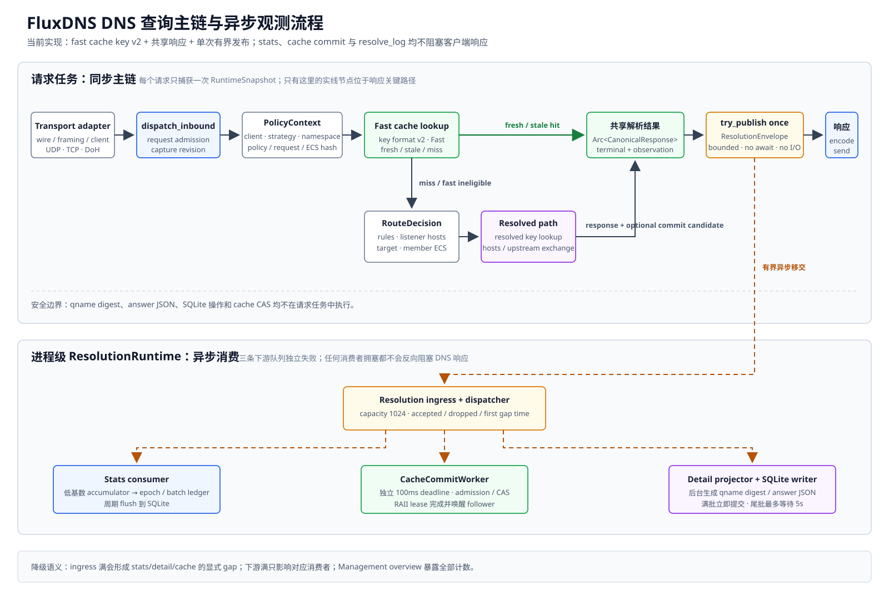

# FluxDNS Rust 后端架构设计

> 文档状态：有效
>
> 实现状态：部分实现
>
> 适用范围：FluxDNS Rust 后端总体架构、跨模块边界、运行时契约与 v1 设计
>
> 最后核对：2026-09-04
>
> 关联文档：[配置字段参考](configuration-reference.md) · [后端模块文档索引](modules/README.md)

## 1. 结论

v1 采用单进程、单 Rust binary、异步事件驱动架构：

- `tokio` 负责 runtime、socket、timer、任务监督和优雅停机；
- `hickory-proto` 作为低层 DNS 协议库，只负责 DNS wire、RR、EDNS/ECS 编解码；
- UDP/TCP transport 自行实现，不把权威 DNS 的 `Catalog/Authority` 模型作为网关核心；
- DoH 入站当前使用仓库内有界 HTTP/1.x session/parser，TLS 使用 `rustls`；HTTP/2 adapter 后置；
- DoH 上游使用 `reqwest` + `rustls`，按上游和 outbound 组合复用 client，并关闭默认 system proxy；
- 内存缓存使用 `moka::sync::Cache`，持久化缓存使用独立 SQLite 文件；缓存通过 `CacheStore`/`PersistentCacheStore` 接口接入，具体后端可替换；
- 解析完成事件先进入进程级统一有界 ingress，再由后台 dispatcher 分发给聚合统计、异步 cache commit 和可选详情投影；业务持久化使用 `sqlx` + SQLite，聚合统计默认开启，因此 `database` 是启动必需依赖；
- 规则和 hosts 编译成按资源独立版本化的不可变 snapshot，资源注册表通过 `arc-swap` 原子发布，资源变化不再用全局 generation 直接清空缓存；
- DNS 核心只依赖 canonical message、request context 和协议无关的 port，不直接依赖 UDP/TCP/DoH、HTTP client、SQLite 或 Moka；
- WebUI 使用独立的 HTTP Management listener 和 `axum` router，认证、session、首次初始化与内嵌静态资源不进入 DoH 或 DNS 数据面。

仓库固定 `backend/` 与 `frontend/` 两个相互独立的代码主目录；根目录只承载仓库级文档、配置示例和工具配置，不作为任一端的工程目录。`backend/` 当前使用一个 binary crate，`frontend/` 使用 React + TypeScript + Vite 独立 SPA，并通过 `webui-embed` 在发布时内嵌到 Rust binary。v1 后端不建立多 crate workspace；等出现可独立复用或需要独立发布的组件后再拆 crate。

## 2. 技术栈

| 领域 | 采用 | 主要职责 |
| --- | --- | --- |
| 异步 runtime | `tokio`、`tokio-util` | I/O、timer、`JoinSet`、`CancellationToken`、有界 channel |
| socket | `socket2` + Tokio socket | bind 前设置 IPv6 v6-only 等平台相关选项，再交给 Tokio |
| DNS wire | `hickory-proto` | 低层 `Message`、RR、EDNS、ECS 和 DNS wire 编解码，不承担网关路由 |
| HTTP/DoH server | 仓库内 HTTP/1.x session/parser | DoH routing、GET/POST/Host 校验、连接上下文、超时和有界 keep-alive；HTTP/2 后置 |
| HTTP/Management server | `axum`、`tower` | 独立 HTTP/1.1 listener、API/router 边界、请求限制和优雅关闭；不终止 TLS |
| TLS | `rustls`、`tokio-rustls` | DoH 入站 TLS 和上游 HTTPS；证书解析复用 `rustls` PEM API，并显式选择和验证 crypto provider |
| DoH client | `reqwest` | `default-features = false`，显式启用 `rustls`、`http2`、`socks`；连接池、代理和 Host/SNI 保持 |
| PROXY protocol | 仓库内有界 parser | 解析 PROXY v1/v2，并负责 TCP 分片、超时、最大长度、trusted proxy 和 required 语义 |
| YAML/config | `serde`、`yaml_serde`、`serde_path_to_error` | 严格 DTO 反序列化、字段路径错误；`deny_unknown_fields` 拒绝未知字段 |
| 地址和值 | `url`、`ipnet`、标准 `Duration` | URL、CIDR、duration 的强类型解析 |
| 内存缓存 | `moka` | 并发缓存、按 entry weight 计费、逐条过期；容量是应用层预算，不是 RSS 硬上限 |
| 数据库 | `sqlx` + SQLite | `runtime-tokio`、`sqlite`、`macros`、`migrate`；migration、解析明细、聚合统计、持久化缓存 |
| snapshot | `arc-swap` | 低频原子替换、高频无锁读取规则/hosts snapshot |
| 错误与日志 | `thiserror`、`anyhow`、`tracing`、`tracing-subscriber` | 库层结构化错误、进程边界上下文、EnvFilter 和结构化事件 |

直接依赖只启用需要的 feature；`reqwest` 必须禁用默认 feature，并在 `ClientBuilder` 中显式调用 `.no_proxy()`，避免 DNS 服务意外继承 `HTTP_PROXY`/`HTTPS_PROXY`/`ALL_PROXY`。v1 不采用 `Figment` 作为主解析器：当前配置是单 YAML、严格 schema，层级继承和 SecretRef 需要显式业务语义；未来若增加环境或 profile 覆盖，应放在严格 DTO 之后的受控层。

`mise.toml` 将 Rust `1.98.0` 作为工具链基线。下表只表示 2026-08-30 的兼容主版本检索基线，不把 docs.rs 的 latest 当作永久锁定；实现时在 `backend/Cargo.toml`/`backend/Cargo.lock` 固定精确版本，并通过带 `--manifest-path backend/Cargo.toml` 的 Cargo 检查、集成测试和 MSRV CI 重新验证。

| 组件 | 检索基线 | 官方参考 |
| --- | --- | --- |
| `tokio` / `tokio-util` | `1.x` | [Tokio](https://docs.rs/tokio/latest/tokio/) |
| 入站 DoH HTTP/1.x | 仓库内有界 parser/session | 不引入 Web framework；HTTP/2 后置 |
| `hickory-proto` | `0.26.x` | [hickory-proto](https://docs.rs/hickory-proto/latest/hickory_proto/) |
| `reqwest` | `0.13.x` | [reqwest](https://docs.rs/reqwest/latest/reqwest/) |
| `rustls` / `tokio-rustls` | `0.23.x` / `0.26.x` | [rustls](https://docs.rs/rustls/latest/rustls/) |
| `yaml_serde` / `serde_path_to_error` | `0.10.x` / `0.1.x` | [yaml_serde](https://docs.rs/yaml_serde/latest/yaml_serde/) |
| `sqlx` / `moka` / `arc-swap` | `0.9.x` / `0.12.x` / `1.x` | [sqlx](https://docs.rs/sqlx/latest/sqlx/)、[moka](https://docs.rs/moka/latest/moka/)、[arc-swap](https://docs.rs/arc-swap/latest/arc_swap/) |
| `socket2` | `0.6.x` | [socket2](https://docs.rs/socket2/latest/socket2/) |

## 3. 模块边界

```text
backend/src/
├── main.rs                 # 进程入口、退出码
├── app.rs                  # 启动编排、进程信号、错误和退出码
├── config/
│   ├── doh_route.rs         # DoH path 模板共享编译、匹配和冲突检测
│   ├── model.rs            # 与 version: 1 对应的 serde DTO
│   ├── load.rs             # YAML、SecretRef、路径解析
│   ├── migrate.rs          # MigrationStep、MigrationReport、版本链
│   ├── resolve.rs          # 默认值/继承归一化为 ResolvedConfig
│   └── validate.rs         # 引用、环、bind 和条件字段
├── transport/
│   ├── udp.rs
│   ├── tcp.rs
│   ├── doh.rs
│   ├── tls.rs
│   └── proxy_protocol.rs
├── ports/
│   ├── inbound.rs          # 入站适配器与 response encoder 契约
│   ├── exchange.rs         # 协议无关的上游 exchange/selection 契约
│   ├── cache.rs            # cache store 与持久化 store 契约
│   ├── observation.rs      # 单次解析完成事件与非阻塞发布契约
│   ├── storage.rs          # resolve log、stats、migration 契约
│   ├── telemetry.rs        # structured log、metrics 和 tracing facade 契约
│   └── effects.rs          # clock、fetcher、secret、socket 等副作用
├── dns/
│   ├── message.rs          # canonical query/response
│   ├── context.rs          # RequestContext 与请求元数据
│   └── handler.rs          # transport 无关的请求管线
├── policy/
│   ├── client.rs           # client_id/IP 匹配
│   ├── strategy.rs
│   └── route.rs
├── upstream/
│   ├── doh.rs
│   ├── group.rs
│   ├── bootstrap.rs
│   └── outbound.rs
├── cache/
│   ├── key.rs
│   ├── memory.rs
│   ├── persistence.rs
│   └── service.rs
├── resource/
│   ├── hosts.rs
│   ├── rules.rs
│   ├── loader.rs
│   └── snapshot.rs
├── runtime/
│   ├── prepared.rs         # PreparedRuntime、候选运行时和 preflight
│   ├── snapshot.rs         # RuntimeSnapshot 与 revision 发布
│   ├── coordinator.rs      # ActiveRuntime CAS、资源合并和 drain
│   ├── bind.rs             # BindPlan 与 listener 生命周期
│   └── supervisor.rs       # task 监督、故障分级和优雅停机
├── management/
│   ├── server.rs           # 独立 HTTP listener 与 Supervisor task
│   ├── router.rs           # API 路由、请求边界和认证 handler
│   ├── auth.rs             # Argon2id/bcrypt 用户认证
│   ├── session.rs          # 有界内存 session 与 Cookie 策略
│   └── assets.rs           # 编译期资源、缓存和 SPA fallback
├── storage/
│   ├── sqlite.rs
│   ├── service.rs
│   ├── stats.rs
│   ├── resolve_log.rs
│   └── statistics.rs
├── observability.rs
└── resolution.rs           # 进程级解析事件 dispatcher 与异步消费者
```

`management` 使用独立的 Tokio TCP listener 和 HTTP router，不复用 DoH parser、route、TLS 或端口。其 accept loop 由同一个 `Supervisor` 持有，但单个管理请求只访问显式注入的认证、配置和只读查询依赖。

各顶层模块的职责、内部流程、并发/失败语义和验收项见[后端模块文档索引](modules/README.md)。`app.rs` 只负责进程级装配，task 监督、listener 生命周期和 drain 统一由 `runtime/*` 持有。

业务 SQLite 的 SQLx migration 存放在 `backend/migrations/*`，由 `backend/src/storage/sqlite.rs` 在 prepare 阶段嵌入并执行；缓存持久化使用独立 schema，不复用该目录中的业务表。

### 3.1 配置字段到运行时组件映射

配置不是启动参数的平铺集合，而是一张需要在 `prepare` 阶段编译的资源图。每个顶层字段必须有明确的 DTO、校验责任和运行时归属：

| 配置字段 | 解析/校验组件 | 运行时组件与边界 |
| --- | --- | --- |
| `version` | `config::model`、`config::validate` | schema version gate；不支持的版本直接拒绝启动 |
| `work` | `config::load` | 路径归一化、工作目录创建、配置快照复制、资源文件基准 |
| `database` | `config::validate` | `storage::sqlite` migration、聚合统计必需连接、解析明细和独立持久化边界 |
| `logs` | `config::validate` | `observability` filter/输出；详细解析日志由统一解析事件异步投影 |
| `webui` | `config::model`、`config::validate`、`management` | 独立 HTTP Management listener、浏览器 origin、认证/session 和首次初始化配置事务 |
| `dns.cache`、`ttl_override`、`edns_client_subnet`、`resolve_log` | `config::validate`、策略编译器 | `cache`、`dns::handler`、`storage`；分别处理三态缓存、TTL/ECS 继承、聚合统计和详情日志容量 |
| `listener` | `config::validate`、bind planner | `transport::udp/tcp/doh`；展开地址、DoH routes/endpoints、入口 hosts 和默认 strategy |
| `upstreams` | 引用图/循环校验 | `upstream` registry、DoH client、bootstrap、group 和 fallback |
| `strategy` | 规则引用与顺序校验 | `policy::strategy/route`；first-match、默认上游和覆盖计算 |
| `hosts` | 内容格式解析与编译 | `resource` snapshot；命中时生成本地 DNS answer |
| `outbound` | SecretRef 解析、scheme 校验 | `upstream::outbound`；代理凭据只存在内存，不进入日志或序列化输出 |
| `rule_set` | 文件/远程加载、格式解析、引用校验 | `resource` loader/compiler；首次 snapshot 阻止 bind，刷新失败保留旧版本 |
| `clients` | id/IP 冲突和最长前缀校验 | `policy::client`；生成请求级 effective strategy/cache/TTL/ECS |

配置解析固定为两阶段：第一阶段用 `yaml_serde` + Serde DTO 完成类型、未知字段和字段路径错误；第二阶段把 DTO 编译为 `ValidatedConfig`，执行 exactly-one-of、条件字段、引用/循环、继承、bind 和 SecretRef 校验。`webui` 在两阶段都必须经过处理，即使 `enable: false` 也不能走旁路或被丢弃。

请求热路径固定为 `InboundAdapter → DnsCore → ResponseEncoder`；DoH adapter 使用 Config 共享的 route compiler 对真实 HTTP path 匹配一次，再把配置模板的 typed route ID 和可选 client ID 写入请求上下文，Policy 仅按 route ID 查表。`DnsCore` 先生成不依赖逐规则匹配的 `PolicyContext` 并尝试 fast cache key v2，miss 后才执行 `RouteDecision`、hosts/upstream 和 resolved key 路径。Core 完成后在 transport 编码前至多无等待发布一个 `ResolutionEnvelope`。配置继承、优先级和 exactly-one-of 约束以 [configuration-reference.md](configuration-reference.md) 为唯一契约来源，运行时不得重新解释或隐式补默认值。

### 3.2 v1 范围与未来扩展边界

- v1 实现范围：完整解析和校验 `version: 1` 配置（包括 `webui`）、UDP/TCP/DoH 入站、DoH 上游、策略分流、hosts/rule_set snapshot、缓存、SQLite 日志与基础统计。
- WebUI：`webui.enable: false` 时不实例化管理服务；设为 `true` 时必须成功绑定独立 HTTP endpoint，并按 `public_origin` 执行同源和 Cookie 策略。
- DoT/DoQ：v1 不增加 `dot`/`doq` schema、listener、bind 或依赖；未知 transport 类型继续按严格 schema 拒绝。未来只新增 transport adapter，让其产出同一 `RequestContext`/`DnsRequest` 并复用 `dns::handler`；DoT 可复用 TCP framing/TLS，DoQ 的 QUIC stream/datagram 生命周期需另行定稿，不能假设等同于 TCP。
- 上游健康检查、远程版本锁定和管理写操作扩展仍需先形成独立契约，不新增推测性兼容字段。

### 3.3 依赖方向与可替换 SPI

逻辑依赖方向固定为：

```text
domain（DNS/policy/cache/resource model）
        ↓
ports（transport/upstream/cache/storage/telemetry/effects）
        ↓
adapters（UDP/TCP/DoH、DoH client、Moka/SQLite、文件/远程资源）
        ↓
runtime（PreparedRuntime、supervisor、bind planner）
        ↓
binary / CLI
```

DNS 核心不得在公开接口中泄漏入站 HTTP parser、`reqwest`、`sqlx`、`moka`、`rustls` 或 YAML DTO 类型。建议最小稳定接口如下：

- `InboundAdapter`：accept、framing、客户端身份恢复，产出 `DnsRequest`；
- `DnsExchange`/`UpstreamConnector`：发送 canonical query，返回结构化 `UpstreamOutcome`；
- `SelectionPolicy`：实现 round-robin、parallel、failover 等成员选择，只持有协议无关的 connector handle/成员 ID，不持有具体 HTTP/QUIC client；
- `CacheStore`/`PersistentCacheStore`：缓存读写、淘汰、恢复和显式清理；
- `LogSink`/`ResolutionEventSink`：服务事件与单次规范化解析完成事件的写入端；聚合统计和详情是后者的后台消费者；
- `MetricsSink`：counter、gauge、histogram 等指标的记录端，exporter（Prometheus、OTel 或测试内存实现）不进入 DNS core；
- `Clock`、`ResourceFetcher`、`SecretProvider`、`SocketFactory`：隔离时间、网络、秘密和系统 socket 副作用。

port 的稳定性由数据契约保证，而不是由具体 crate 名称保证。关键接口的最小语义如下：

```rust
trait InboundAdapter {
    async fn next_request(&self) -> Result<DnsRequest, InboundError>;
}

trait ResponseEncoder {
    async fn encode_response(
        &self,
        request: &DnsRequest,
        response: Arc<CanonicalResponse>,
    ) -> Result<(), EncodeError>;
}

trait DnsExchange {
    async fn exchange(&self, query: &CanonicalQuery, context: &RequestContext)
        -> UpstreamOutcome;
}

enum UpstreamOutcome {
    Response(CanonicalResponse),
    TransportFailure(TransportFailure),
    Cancelled(CancelReason),
}
```

接口不得暴露 HTTP request/response、UDP socket、QUIC stream、数据库连接或 cache implementation 类型；所有实现都必须遵守 `deadline`、`cancellation` 和 response validation 约定。

其中 `UpstreamConnector` 是 registry/factory 中的已绑定连接器句柄，具体句柄实现 `DnsExchange`；profile、URL、代理、TLS 和连接池状态在句柄内部解析和持有，不能回流到 `DnsCore`。

`InboundAdapter` 与 `ResponseEncoder` 按 listener/connection 关联，但不要求一请求一对象；adapter 可以并发产出多个 request。每个 `DnsRequest` 携带只读关联 token，encoder 只能向对应的响应通道写一次，客户端断开后返回可分类的 cancellation/error，不得让 core 等待已经关闭的 stream。

| port | 必须保持的语义 | v1 默认 adapter |
| --- | --- | --- |
| `CacheStore` | key/entry、TTL、CAS、single-flight 所需的最小操作；不因 resource revision 隐式全局失效 | Moka memory store |
| `PersistentCacheStore` | cache format/version/checksum 校验，恢复失败只降级内存 | 独立 SQLite cache DB |
| `StorageBackend` | migration、事务、健康状态、flush/shutdown | `sqlx` + SQLite |
| `LogSink` | 服务日志保持脱敏，不接收原始 DNS wire 或请求级敏感内容 | `tracing` |
| `ResolutionEventSink` | 每次请求至多一次有界 `try_publish`；队列满不阻塞 DNS，并显式累计 ingress gap | 进程级 resolution dispatcher |
| `StatsRecorder` | 只由后台 dispatcher 更新有界维度，再按日 upsert、checkpoint/补偿计数 | SQLite stats writer |
| `MetricsSink` | 低基数 counter/gauge/histogram；exporter 可替换 | tracing/内存 metrics facade |

生产路径可以使用具体类型和静态分发；只在上述边界使用 trait object 或测试替身，避免为了“灵活”让每个 DNS 查询都承担动态分发成本。

### 3.4 配置迁移与运行时升级

`version` 定义为配置 schema revision。迁移链必须是显式、可测试的纯转换：

```text
parse RawConfigVn
  → migrate n → n+1
  → normalize / resolve defaults
  → semantic validate
  → prepare candidate runtime
  → activate new revision
```

约定如下：

1. 旧版本只能向当前版本迁移；未来版本直接拒绝，不能按旧字段猜测。
2. 严格 unknown fields 继续保留；如确需第三方扩展，只允许明确的 `extensions`/`x-*` 命名空间。
3. DTO 层保留缺失、`null`、空数组和空对象的区别；默认值、数组替换/合并及 cache/TTL/ECS 继承在 `ResolvedConfig` 阶段一次性计算，并保留来源信息。
4. 配置 schema、SQLite schema、资源 parser/compiler 和 cache key format 使用不同版本号。
5. 将变更分类为可热更新、需要 drain/rebind、必须重启；即使 v1 不实现热加载，也保留 `prepare candidate → preflight → atomic activate/keep old` 的接口。
6. 迁移不自动覆盖用户原文件；未来 CLI 提供 `validate`、`migrate`、`print-normalized`、`diff` 和 `rollback`。

迁移实现采用注册表而不是散落在业务字段解析中的兼容分支：每个 `MigrationStep` 只声明一个 `from_version → to_version`，对原始配置文档做确定性、无网络、无数据库和无 Secret I/O 的转换，并返回带字段路径的错误、警告和变更摘要。每个 step 必须满足同一输入重复执行得到同一输出（幂等/可重放），禁止静默丢字段；存在有损删除时必须报出 warning 并由调用方显式确认。加载器先读取版本并运行完整迁移链，再用当前版本的严格 DTO 反序列化；迁移链缺步、重复应用或结果版本不符都拒绝启动。这样新增字段、重命名和结构拆分都有独立 golden test，也不会把旧版本兼容逻辑带进请求热路径。

每次迁移都生成只读 `MigrationReport`（原始/目标版本、step IDs、变更摘要、warning、输入 hash 和输出 normalized hash）。`validate` 只做 dry-run；`migrate` 写入新文件并保留原文件备份；`rollback` 只能选择曾经成功 prepare 的 revision/manifest，不能凭字段猜测旧配置。运行时激活失败时，报告候选失败原因并保留当前 `ActiveRuntime`。

## 4. 核心状态与运行时快照

配置 DTO、校验结果和可服务运行时必须是三个不同层次。`ValidatedConfig` 只表达语义正确的配置，不能直接充当请求热路径状态。

```text
RawConfigVn
  → migration / normalize
  → ValidatedConfig / ResolvedConfig
  → RuntimeSnapshot(revision)
  → PreparedRuntime(candidate)
  → bind
  → ActiveRuntime
  → AppState
```

`PreparedRuntime` 在 bind 前完成路径、引用图、策略索引、上游 connector、adapter-owned transport profile、核心可见 capabilities、资源句柄和数据库/日志能力的预构建，并在同一 prepare 边界装配生产 `ResourceFetcher`。正式 async prepare 对 remote rule-set 先校验落盘 content/manifest fallback，恢复失败后才执行 bounded fetch、解析和原子持久化；对 file hosts/rule-set 则执行稳定读取、hash、解析和编译，再把 typed snapshot 交给 Policy 构造；任一步失败都不会进入 bind。对 `auto_update=true` 的 remote、file rule-set 和 file hosts，ActiveRuntime 会把独立 refresh worker 纳入 service Supervisor，成功候选在同一 Policy core 内做版本化 live publish，并原子更新当前 Runtime 的资源元数据。正式 `run` 路径由 `Application` 创建 `RuntimeCoordinator` 并交给 `DnsService` 持有；资源 task 通过 coordinator 查询当前活动实例，coordinator 也提供已 prepare 候选的 bind/CAS 激活入口。配置文件 watcher 以稳定 fingerprint 触发 service-aware reload：候选完整 prepare 后按 BindPlan 复用或重建 UDP/TCP/DoH listener 和 resource refresh task，旧 task 通过 scoped cancellation 退出；进程持有配置变化和候选失败都保留旧 Runtime。`RuntimeSnapshot` 是请求读取的不可变配置句柄；配置 reload 时先完整 prepare 新 revision，再原子切换，不在请求中重新解释 YAML 或继承规则。

```rust
struct RuntimeSnapshot {
    revision: RuntimeRevision,
    config: Arc<ResolvedConfig>,
    cache_semantics: Arc<CacheSemantics>,
    policy: Arc<PolicyIndex>,
    resources: Arc<ArcSwap<ResourceRegistrySnapshot>>,
    upstreams: Arc<UpstreamRegistry>,
    transport_capabilities: Arc<TransportCapabilitiesRegistry>,
}

struct PreparedRuntime {
    snapshot: Arc<RuntimeSnapshot>,
    bind_plan: Arc<BindPlan>,
    adapters: PreparedAdapters,
}

struct ActiveRuntime {
    prepared: Arc<PreparedRuntime>,
    bound_endpoints: Arc<BoundListenerSet>,
    shared_services: Arc<SharedServices>,
}

struct SharedServices {
    cache: Arc<CacheFacade>,
    storage: Arc<StorageRuntime>,
    telemetry: Arc<Telemetry>,
}

struct AppState {
    active: ArcSwap<ActiveRuntime>,
    supervisor: Arc<SupervisorHandle>,
    shutdown: CancellationToken,
}
```

`RuntimeSnapshot` 只放请求热路径需要的不可变状态，不包含 socket、HTTP connection、数据库连接或 cache implementation；`cache_semantics` 是已解析的 key/TTL/namespace 规则，不是具体 cache backend。`PreparedRuntime` 是无 socket 的候选运行时，完成配置迁移、引用图、策略索引、上游 connector、transport capabilities、资源句柄、首次 remote/file resource snapshot、生产 `ResourceFetcher` 和 auto-update worker 准备；`ActiveRuntime` 继续持有这些 shared adapter/worker，但它们不进入请求 snapshot。资源-only 刷新在当前 ActiveRuntime 内通过 Policy CAS 与 Runtime 元数据 ArcSwap 生效并复用已绑定 listener；配置候选仍需完整 bind 后再切换 `ActiveRuntime`。绑定成功后才形成 `ActiveRuntime`。这样“prepare 失败不影响现有服务”和“bind/rebind 后原子切换”有明确的所有权边界。

每个请求从 `active.load()` 得到同一 `ActiveRuntime`，再捕获其中的 `RuntimeSnapshot` 一次。资源仍可按资源粒度刷新，当前 service 通过 coordinator 代理读取和刷新活动实例；`refresh_resource_if_current` 在刷新前后确认 captured runtime 仍是 active，候选切换期间的旧结果会被标记为 stale 并由下一轮重新读取。候选激活已在 coordinator 层提供 bind/CAS 原子边界，service reload 还会在 CAS 成功后注册新 revision 的 transport/resource task 并取消旧 token；Application 文件 watcher 已通过稳定 fingerprint 串行触发该入口，hosts 与 rule_set 并发刷新通过 per-resource epoch/CAS 合并，后发布者不会覆盖其他资源。资源内容更新复用现有 bound endpoints 和 shared services；需要 rebind 的候选则先绑定新 endpoints，成功后原子替换 `ActiveRuntime`，旧实例进入 drain。

资源内容刷新不创建新的 `ActiveRuntime`，只在当前实例内发布新的 Policy/资源 metadata snapshot，因此自然复用 listener 与 shared services。只有配置候选才执行 `ActiveRuntime` swap；需要 rebind 时新旧 listener set 独立存在，旧 set 在 grace deadline 后关闭。Storage 与 Telemetry adapter 由进程级 `DnsService` 持有，配置 reload 会使用同一组 stats/detail/telemetry sink 包装新 core；相关进程级配置变化必须返回 `RestartRequired`，不能在 revision 切换中替换这些实例。

```text
resource content change
  → bounded read/fetch + parse
  → per-resource Policy/metadata CAS in current ActiveRuntime

config change
  → build PreparedRuntime candidate (no externally visible socket)
  → preflight + bind new endpoints when required
  → atomic ActiveRuntime swap
  → old ActiveRuntime drain → close
```

统一请求上下文拆分为协议无关元数据、客户端身份和 transport 能力：

```rust
struct DnsRequest {
    query: CanonicalQuery,
    context: RequestContext,
}

struct RequestContext {
    meta: RequestMeta,
    client: ClientIdentity,
    transport: TransportCapabilities,
    runtime_revision: RuntimeRevision,
}

struct TransportCapabilities {
    class: TransportClass,                 // datagram / stream / multiplexed
    cache_compatibility: CacheCompatibilityKey,
}

struct RequestMeta {
    request_id: RequestId,
    trace_id: Option<TraceId>,
    received_at: Instant,
    received_at_utc: UtcTimestamp,
    deadline: Instant,
    cancellation: CancellationToken,
    connection_id: Option<ConnectionId>,
    stream_id: Option<StreamId>,
    listener_id: ListenerId,
    route_id: Option<RouteId>,
    original_dns_id: Option<u16>,
}
```

`peer_addr`、`client_addr` 和 `client_id` 放在 `ClientIdentity` 中并允许缺省；`listener_id`/`route_id` 用于策略和聚合统计的有界维度，不能把原始 URL、完整 query string 或敏感 header 放入 context。DoH `route_id` 固定使用配置模板，不含实际 client ID；裸路径命中尾部 `{client_id}` 模板时 `client_id` 为 `None`。DoQ/HTTP2 的连接与 stream 生命周期不能被压缩成单一 `Transport` 枚举。`TransportCapabilities` 只包含核心确实需要的协议无关事实（例如 `datagram/stream/multiplexed` class 和 opaque `cache_compatibility`）；framing、最大 wire、HTTP status、UDP 截断和 DNS ID 重写留在 adapter-owned `TransportProfile`/`ResponseEncoder`。`DnsCore` 只接收 canonical request 和 context。

元数据生命周期也要由 port 契约固定：`request_id` 在 ingress 生成且全链路只读，`trace_id` 缺失时可由观测 facade 生成；`received_at`/`received_at_utc`/`deadline` 使用可注入的 `Clock`，deadline 只能向下游缩短不能延长；客户端断开、stream 关闭、进程 shutdown 或上游取消都会传播 `CancellationToken`。UDP 请求没有 connection/stream ID 时使用 `None`，HTTP/2/未来 QUIC 则分别填充 connection 与 stream ID。所有日志和 metrics 只使用脱敏后的 ID、listener/route 名称和低基数标签。

## 5. 启动与停止顺序

启动阶段严格分为 `prepare` 和 `serve`，任何 prepare 失败都不绑定 listener：

1. 读取 YAML，按 `version` 解析 `RawConfigVn`，拒绝未知字段；
2. 执行显式配置迁移，再归一化路径、SecretRef、URL、CIDR、duration 和默认值，得到 `ResolvedConfig`；
3. 执行引用、循环、条件字段、缓存阈值、WebUI origin 和统一 bind 冲突校验；
4. 打开必需的 SQLite，执行 schema migration，并验证可写性；聚合统计默认开启，因此该步骤失败必须阻止启动；
5. 构建日志/统计 writer、远程资源首次下载所需的 outbound connector、上游 connector registry 和 per-resource resource registry；
6. 编译全部首个 hosts/rule snapshots，计算每个资源的版本、content hash 和来源状态；若未来 schema 增加 expected checksum/version pin，再在此处执行对应校验；
7. 初始化 `CacheFacade`、内存/持久化 cache store、transport capabilities/profiles 和策略索引；持久化 cache 初始化失败只标记 degraded 并回退内存，不改变数据库统计的必需性；
8. 生成无 socket 的 `RuntimeSnapshot`/`PreparedRuntime` candidate 并完成 preflight；
9. 创建全部 socket，任何 bind 失败都关闭已创建 socket 并退出；成功后组合成包含 `bound_endpoints` 的 `ActiveRuntime`，再原子发布首个 runtime；
10. `Application` 将 `RuntimeCoordinator` 交给 `DnsService`，并启动进程级 resolution runtime；supervisor 启动 UDP、TCP、DoH、Management、资源刷新、缓存持久化、统计 writer、详情 SQLite writer 和 telemetry 任务。`DnsService` 在等待退出信号时同时观察 task completion，网络 task 使用独立 scoped cancellation，显式 service reload 可将 DNS transport 切换到新的 active runtime。

停止时先停止接收新请求，再取消后台 refresh/accept，等待正在处理的请求到 `grace deadline`；随后停止并排空 resolution ingress、cache commit 和详情 projection worker，释放未提交 single-flight lease，再排空历史/当前 Runtime 的 cache persistence finalizer，flush 统计与 SQLite，最后关闭 Telemetry 后退出。后台任务必须由 supervisor 或显式 process owner 持有，不能 detach 后丢失 panic 或错误。

### 5.1 supervisor 故障策略

supervisor 对 task 使用结构化生命周期和显式故障等级，不以“所有错误都重启”作为默认策略：

| 组件/故障 | v1 处理 | 对 DNS 数据面的影响 |
| --- | --- | --- |
| 启动/rebind 的 listener bind 失败 | `fatal-candidate`；拒绝候选并保留旧 `ActiveRuntime`（首启则退出） | 已运行实例继续服务；首启不对外提供服务 |
| 运行中单个 endpoint 的 accept/socket 瞬时错误 | 无流量 `Timeout` 作为正常 deadline 轮询；其他瞬时错误有界退避重试，达到 endpoint restart limit 后标记 failed；只有逻辑 listener 没有可用 endpoint 才升级为 `fatal` | 空闲不消耗重试预算；其他 endpoint 继续服务；无可用 endpoint 时停止进程 |
| 单个请求解析、上游超时或客户端取消 | `request-local`；记录结构化原因并结束该请求 | 不影响其他请求 |
| 单个资源刷新失败、内容校验不匹配或解析失败 | `degraded`；保留该资源最后有效 snapshot，指数退避并封顶重试；超过 stale horizon 只升级告警，不自动清空或替换为半成品 | 继续使用旧资源；无旧 snapshot 的引用请求 fail-closed；不清空缓存 |
| 资源刷新产生乱序结果 | `stale-result`；按 per-resource epoch/CAS 丢弃旧结果 | 不改变当前 runtime |
| resolution ingress 队列满 | `degraded`；整条完成事件和 cache candidate 被丢弃，累计 `dropped` 并冻结首次 `gap_started_at` | 不影响 DNS 响应；该请求的 stats/detail 形成明确 gap，cache lease 由 RAII 释放 |
| 详情 projection/SQLite writer 队列满或提交失败 | `degraded`；只累计 `detail_dropped`/`detail_failed` | 不影响 DNS、cache commit 或聚合统计 |
| 聚合统计 writer 运行时数据库短暂不可写 | `degraded`；写入进程内补偿计数并重试，恢复后按序补写 | DNS 继续服务；进程崩溃前未落盘部分需报告为 persistence gap |
| 聚合统计 pending batch/补偿计数达到固定内存保护上限 | `fatal`；停止接收新请求，执行有限 flush 后退出 | 避免数据库长期故障导致 OOM；退出前报告未持久化 gap |
| cache persistence writer 失败或队列满 | `degraded`；失败批次计数后继续，队列满则丢弃本批，始终保留内存 cache；停机时汇总 persistence gap | 不影响 DNS；重启后可能丢失未持久化 cache |
| structured log writer/telemetry sink 不可用 | `degraded`；保留本地低基数 counters，日志回退 stderr/内存 ring buffer | 不影响 DNS；观测可能出现明确的 telemetry gap |
| supervisor 自身 panic、不可恢复的 task panic 或 shutdown 超时 | `fatal`；取消所有 task，执行有限 flush 后退出并返回非零状态 | 进程退出，交由外部守护进程决定是否拉起 |

数据库在启动阶段不可打开、migration 失败或没有写权限时属于 `fatal`，因为聚合统计是默认开启且有数据库持久化契约；运行中数据库故障属于 `degraded`，不能把每次 DNS 请求同步阻塞到数据库恢复。所有降级状态都必须进入 metrics/structured log，并带上组件、首发时间、最近重试时间、当前 stale age 和是否存在持久化缺口。v1 不在进程内无限重启 listener 或 supervisor；`Supervisor::spawn_with_factory` 现已为可重建 task 提供瞬时失败的有界指数退避和上限耗尽标记，`spawn_scoped_with_factory` 还可保留 task-scoped cancellation，transport listener task 已接入三次有界瞬时重试并复用 adapter 通过 `Arc` 持有的 bound socket/listener，JoinSet 的 panic/abort 结果按 Tokio task ID 映射回完整 FluxDNS `TaskSpec`。`DnsService` 按当前 revision 和 `BindEntry.owner` 聚合 endpoint：单个 endpoint 重试耗尽但同一逻辑 listener 仍有 sibling 时只降级，最后一个 endpoint 耗尽才升级运行期错误；旧 revision 的迟到完成不影响新 Runtime。最终 FatalEndpoint/Fatal 和 task panic 会在返回原始错误前按 shutdown grace period 停止请求、关闭其余 task、提交 Storage 并关闭 Telemetry；清理失败或超时另行记录但不覆盖首要故障。v1 不在进程内关闭并替换 ActiveRuntime 持有的 listener 来自动 rebind，逻辑 listener 全部不可用后退出并交给外部守护进程；完整 endpoint/resource/storage 故障矩阵和外部 service manager 接管仍需后续验证。

## 6. 请求管线

```text
UDP / TCP / DoH（未来 DoT / DoQ）
        │
InboundAdapter：协议校验、framing、client IP 恢复、RequestMeta
        │
DnsRequest { query: CanonicalQuery, context: RequestContext }
        │
DnsCore：捕获当前 RuntimeSnapshot
        │
PolicyContext：client、strategy、namespace、ECS、policy/request fingerprint
        │
fast cache key v2 lookup ── fresh/stale hit ─────────┐
        │ miss                                       │
RouteDecision：rule / hosts / upstream target        │
        ├─ hosts[] 本地回答（绕过 response cache）   │
        └─ resolved key lookup / DnsExchange         │
                       │ cache admission candidate   │
                       └─────────────────────────────┤
        │
Arc<CanonicalResponse> + 一次 ResolutionEnvelope try_publish
        │
adapter-owned ResponseEncoder → 返回客户端
        └─ 后台 dispatcher → stats / cache commit / 可选 detail projection
```

完整流程图见 [`dns-query-pipeline.svg`](dns-query-pipeline.svg)：



UDP、TCP、DoH 只处理 framing 和传输限制；策略、缓存和上游逻辑只实现一次。TCP 使用两字节 DNS length framing。DoH 和 TCP 不受客户端 EDNS UDP payload size 限制；UDP 在发送时按当前请求重新编码并在必要时设置 TC。每个请求在进入 client matcher、策略和 cache lookup 之前只捕获一次当前 `RuntimeSnapshot`，避免同一个请求跨越多个不一致的资源组合。

fast lookup 只跳过逐规则 matcher，不跳过 client、strategy、namespace、ECS 和语义 fingerprint 计算。`PolicyContext` 的 policy fingerprint 覆盖会改变答案的已解析配置、hosts/rule 资源内容 hash 和选择安全性；日志、WebUI、database 等纯观测/管理字段不进入 key。相关策略或资源内容变化时，新请求自然使用新 key，旧 entry 不需要全局清空并按自身生命周期淘汰。`hosts[]` 的 listener/strategy 本地回答仍绕过 response cache；`upstreams[type=hosts]` 按普通上游响应处理。group member ECS 只有在成员选择后才能确定，当前回退完整 route/upstream 并继续绕过 response cache，避免用 group ID 混用不同成员响应。

## 7. 缓存实现

### 7.1 namespace 与容量

`CacheFacade` 负责读取当前 `RuntimeSnapshot.cache_semantics`、选择逻辑缓存池、执行 single-flight/coalescing、处理 optimistic refresh 和显式清理；实际读写委托给 `CacheStore`。v1 的默认实现是一个共享的 Moka store，key 中携带 pool namespace，形成全局、策略、客户端+策略三类逻辑池。这样 `dns.cache.memory.max_size_bytes` 是整个进程的单一容量预算，不会随策略或客户端数量成倍扩张。未来替换为其他内存 cache、分布式 cache 或测试 fake 时，DNS core 不需要改变。

Moka 使用 `weigher` 计算 key、canonical wire、索引和元数据的计费字节；该值用于可预测淘汰，但不是操作系统 RSS 的硬限制。

### 7.2 entry 与过期

缓存 entry 不保存客户端 DNS ID、HTTP header 或本地 UDP 截断 envelope，保存共享的 canonical response、写入时间、TTL metadata、response class、产生该答案时的 `producer_revision` 和 upstream provenance。上游 TC entry 额外携带入口 transport，只允许同 transport 命中。正向/负向 TTL、`failure_ttl` 和 optimistic max age 由 per-entry expiry 实现；compare-and-replace 禁止 SERVFAIL/TC 覆盖未过期的完整回答。

cache key format v2 显式区分 `Fast` 与 `Resolved`，两种模式不能 alias。共同维度包含 namespace、canonical query wire、transport compatibility，以及 opaque 的 policy/request/target/ECS fingerprint；不包含 DNS ID、原始 client 地址或整个 `RuntimeSnapshot` revision。`Fast` 在逐规则决策前使用稳定的 policy/request 语义，`Resolved` 可再携带最终 target/ECS。相关规则或 hosts 内容 hash 变化会切换 policy fingerprint，但不会扫描或清空全局 cache；旧 entry 按自身 TTL、负缓存 TTL、`failure_ttl` 和 optimistic `max_age` 自然淘汰。无法在 lookup 前安全确定的成员 ECS 请求不使用 fast key。

每次请求仍必须先用最新 `RuntimeSnapshot` 完成 client matcher、生效 strategy、namespace、ECS 和 policy/request fingerprint 计算；fast miss 后才执行逐规则选择、hosts 判断和 upstream target 决策。这样 cache hit 可以省去 matcher 与上游工作，而配置/资源语义变化后的请求不会命中旧 fingerprint。

旧 fingerprint 的 entry 不会被同步删除，因此仍占用容量直至自然淘汰；这是避免资源刷新扫描全库的空间换时间取舍。未来 WebUI 的“清除缓存”仍应调用 `CacheFacade::invalidate(namespace/key/predicate)`，而不是让普通资源刷新执行全局 clear。

当 optimistic/stale 命中触发后台刷新时，刷新任务重新读取当前 `PolicyDnsCore` 的最新资源 snapshot，并执行完整的 context → route → upstream exchange，不能复用 entry 中的旧上游、旧规则或旧资源指针。刷新写回使用 key + revision-independent CAS，并拒绝较旧的 `producer_revision` 覆盖较新的完整答案。

上游结果先形成持有 single-flight lease 的 `CacheCommitCandidate`，与同一 `ResolutionEnvelope` 一次性移交后台 cache worker；客户端响应不等待 store CAS 或持久化入队。worker 使用独立的 100ms deadline 提交，按 `stored/rejected/conflict/unavailable/dropped` 计数；任意队列丢弃、取消或 candidate drop 都通过 RAII 发布失败终态并唤醒 waiter。由此 cache lookup 状态只描述响应完成前的命中结果，异步 write outcome 不伪装成当前请求的 `cache_status`。

持久化缓存实现 `PersistentCacheStore`，使用 `dns.cache.persistence.path` 指定的独立 SQLite 文件，与解析日志数据库分离。`max_size_bytes` 转换为主数据库 page budget；WAL/SHM 的短时额外占用不计入该值。内存 commit 成功后的持久化仍通过有界队列批量提交；超出预算或持久化失败只降级为内存缓存，不让 DNS 请求失败。恢复时必须重新检查 cache format version、entry checksum、expiry 和 key format v2 compatibility；旧 key format 记录按不兼容隔离。

## 8. `parallel` 上游组

上游执行器只依赖协议无关的 `DnsExchange`；DoH、未来 DoT/DoQ 或本地 mock 都实现同一接口。`SelectionPolicy` 先选择已经绑定 profile 的 connector 实例，`DnsExchange` 只接收 canonical query 和 `RequestContext`，不把 `UpstreamProfile`、`reqwest::Response`、HTTP status 或 QUIC stream 类型泄漏到 DNS core。连接池、TLS session、代理和实时 in-flight 状态属于 connector adapter 的内部状态；v1 不实现主动健康检查或持久健康分数。

`SelectionPolicy` 只负责成员选择、超时窗口和 fallback 判定，不直接创建网络 client；它可以返回已绑定的协议无关 connector handle。这样增加新的传输协议或替换 HTTP client 时，不需要改动 `DnsCore`、缓存准入或统计维度。

每个并行成员作为受监督 task 运行，并向 aggregator 发送以下结构化结果：

- `Response(CanonicalResponse)`：terminal DNS response，wire 合法、响应标志合法、问题段匹配；
- `TransportFailure`：timeout、连接、TLS、HTTP、解析或问题段错误，包含可重试性和安全可记录的分类；
- `Cancelled`：请求 deadline、客户端断开或组策略主动取消。

aggregator 收到第一个 terminal response 后立即完成客户端响应。缓存 finalizer 独立于客户端 responder：

- 首响应是完整 `NOERROR/TC=0` 时直接作为缓存候选，并取消其余成员任务；
- 首响应是 NXDOMAIN、REFUSED、SERVFAIL 或 TC 时，继续持有已发任务直到完成或 group timeout，并收集缓存候选；
- 窗口结束后先从完整 `NOERROR/TC=0` 中按成员配置顺序选择；没有时再从其他允许缓存的响应中按成员配置顺序选择；REFUSED 不缓存；
- late result 只能写缓存和观测日志，不改变已返回给本次客户端的响应；
- 只有主组完全没有 terminal response 才执行 fallback。

必须为“快速 SERVFAIL + 慢速 NOERROR”“快速 TC + 慢速完整响应”“快速 REFUSED + 慢速 NXDOMAIN”和全部 transport failure 编写确定性异步测试。

## 9. DoH 与连接接入层

DoH route 同时实现 GET/POST，并在进入 DNS core 前完成 request-line、Host cardinality、Content-Type、body/wire length 和 DNS parse 校验。method 必须符合 token 语法，request-target 只接受可见 ASCII；`application/dns-message` 的 type/subtype 大小写不敏感且不接受未定义参数。HTTP/1.1 缺失 `Host` 或任意 HTTP/1.x 重复 `Host` 返回 400 并关闭连接；有效 DNS 错误响应仍返回 HTTP 2xx，HTTP 错误只表示没有形成可处理的 DNS transaction。TCP 与 DoH listener 各自最多持有 1,024 个 active session，达到上限时暂停 accept 并优先回收已结束 session。

HTTP access log 和 tracing 不记录 query string、raw DNS wire、完整 `client_id` 或 ECS；只记录 route template、方法、状态、wire 字节数和脱敏后的请求关联 ID。

接入层使用固定协议常量，不新增运行时配置：

```text
MAX_DNS_WIRE_BYTES       = 65_535
MAX_DOH_POST_BODY_BYTES  = 65_535
MAX_DOH_GET_DNS_CHARS    = 87_380
MAX_DOH_HEADER_BYTES     = 16_384
MAX_DOH_REQUEST_TARGET_BYTES = 131_072
MAX_PROXY_V1_BYTES       = 107
MAX_PROXY_V2_BYTES       = 536
```

这些是 adapter 的硬安全上限，不是 DNS core 的业务配置。adapter-owned `TransportProfile` 负责 framing、最大响应尺寸、HTTP 状态码、UDP 截断和 response encoding；只向 core 暴露稳定的 `TransportCapabilities` 与 opaque `cache_compatibility`。因此 DoT/DoQ 后续只需增加 profile/adapter，不需要在核心请求模型中继续扩展 `Transport` 枚举分支。

HTTP request-target 上限必须容纳路由路径、`?dns=` 和完整的 `MAX_DOH_GET_DNS_CHARS`，否则 GET 会在达到 DNS wire 上限前被提前拒绝。实现对 request-line、header fields 和 POST body 独立计费，session buffer 使用三者之和形成固定总上限。

DoH endpoint 的 accept pipeline 为：

```text
TCP accept
  → peer CIDR trust check
  → optional required PROXY v1/v2 parser
  → optional rustls handshake
  → bounded HTTP/1.x session/parser
  → route matcher
```

其中 “optional” 由 endpoint 的 `client_ip.source`/`tls.mode` 决定；一旦选择 `proxy_protocol`，前导头就是 required。解析器只自动识别 v1/v2，不猜测裸 HTTP/TLS。未知 v2 TLV 在长度合法时跳过，未知协议版本拒绝。

## 10. DoH 上游与代理

DoH client 是 `DnsExchange` 的一个 adapter，而不是 DNS core 的依赖。`UpstreamRegistry` 保存 connector factory 和上游 profile；`SelectionPolicy` 只拿到 connector 的统一结果。将来增加 DoT/DoQ 时，应新增 adapter 和 capability profile，复用同一 canonical query、deadline、取消和 outcome 语义。

每个 `(upstream, outbound, bootstrap/connect_ip)` 组合复用一个 `reqwest::Client`，避免每个 DNS 请求重建 TLS 和 HTTP/2 连接池。

- `connect_ip` 通过 reqwest 的 `resolve` 或自定义 connector 建连，URL host 继续用于 HTTP `Host` 和 TLS SNI；具体实现必须用 integration test 证明，不把单一 API 的行为当作代理组合的保证；
- `bootstrap` 先通过已验证的上游解析地址，再构建/刷新该 client 的地址 override；
- `socks5://` 与 `socks5h://` 的本地/代理解析语义按配置契约实现；reqwest 只提供代理原语，`connect_ip`、bootstrap 和 SOCKS 组合需要单独的 connector/integration tests；
- 不读取环境代理作为隐式出口；client 构建必须显式关闭 system proxy，SecretRef 内容不得进入日志；
- `bootstrap`/group/outbound 引用图在启动时检查循环，禁止解析路径自依赖。

上游响应必须验证 HTTP status、Content-Type、DNS ID/问题段和 wire 完整性。HTTP 非 2xx、无效媒体类型或 malformed DNS 都属于 transport failure，而不是可返回的 SERVFAIL。

## 11. 资源 snapshot

资源加载流水线固定为：

```text
读取/下载 → 原始格式解析 → 规范化 → 交叉校验 → 编译索引
          → 临时文件 fsync/rename → ResourceSnapshot(resource_revision)
          → ResourceRegistryCoordinator::publish(resource_name, CAS)
```

`ResourceRegistrySnapshot` 是不可变注册表，但注册表中的每个资源独立拥有版本，不使用一个全局 generation 表示所有资源：

```text
ResourceRegistrySnapshot
  ├─ hosts/cn: ResourceSnapshot { revision, content_hash, parser_version, ... }
  ├─ rules/private: ResourceSnapshot { revision, content_hash, parser_version, ... }
  └─ ...
```

每个 `ResourceSnapshot` 至少记录 `resource_name`、单调递增 `resource_revision`/`epoch`、`content_hash`、`source_revision`（ETag/Last-Modified 或本地文件 fingerprint）、`parser/compiler_version`、`fetched_at`、来源路径/URL 和是否使用 fallback。资源 coordinator 对同一资源做 single-flight，并以 epoch/CAS 发布；乱序或重复刷新结果必须被拒绝，不能回退已发布版本。多个资源并发更新时，顶层 runtime coordinator 以当前 `ActiveRuntime` revision 做 CAS/串行重试，合并最新 registry，而不是从同一旧 registry 各自生成候选。

首次启动必须为所有已配置资源产生有效 snapshot。远程下载失败时可使用上一轮已校验并落盘且版本兼容的 snapshot；两者都不可用则启动失败。运行中的刷新失败只记录错误并保留该资源旧 snapshot，其他资源继续更新。对启用 `auto_update` 的资源，重试采用指数退避并封顶 5 分钟；连续三次计划刷新失败或距上次成功超过 `3 × update_interval` 后标记 `stale`，仍可继续使用旧 snapshot。没有旧 snapshot 的资源引用必须 fail-closed，而不是使用未完成编译的内容。

当前 ActiveRuntime 的资源成功更新只替换 `ResourceRegistrySnapshot` 中对应资源，并通过同一 `PolicyDnsCore` 的 per-resource CAS 和 `RuntimeSnapshot` 的 metadata ArcSwap 发布；它复用已绑定 listener、**不**触发全局 cache clear，也不要求所有资源一起重新加载。真正需要配置候选或 listener 变化时，仍生成新的顶层 `RuntimeSnapshot.revision` 并走完整 `PreparedRuntime → bind → ActiveRuntime` CAS。请求在下一次进入 policy/rule matcher 时读取最新资源；optimistic refresh 同样必须读取刷新时刻的最新 registry，并重新匹配规则后再发起上游请求。

domain exact、suffix、regex、CIDR 等匹配结构在加载时编译，查询热路径不读取文件、不解析 YAML/JSON/Clash/dat，也不持有更新锁。

## 12. SQLite 日志与统计

`database.type`/`database.path` 是必填字段，即使 `dns.resolve_log.enable: false` 也必须打开数据库。v1 不提供关闭聚合统计的配置项：聚合统计默认开启，并且必须依赖该数据库持久化。prepare 阶段完成 SQLite 打开、schema migration、基本读写和目录权限检查；任何失败都是启动 `fatal`。

storage 通过可替换的 `StorageBackend` 接口提供 migration、事务、健康检查和 shutdown；默认 adapter 是 SQLite。`StatsPersistenceWorker` 维护 epoch snapshot、batch ledger 和可重试事务；`StorageRuntime` 在 Application prepare 阶段组装 stats worker、详情 SQLite writer 和 backend，并由 `DnsService` 注册受监督的周期 flush task。统计 pending batch/event 已有固定内存保护，超限时保留活动 epoch 并通过 Supervisor 升级 fatal；普通数据库不可用仍按 degraded 路径保留 pending 重试，SQLite 成功的有限操作可将状态恢复为 healthy，不可恢复 adapter 错误保持 failed。当前数据面只向 `ResolutionEventSink` 发布一次 typed 完成事件；后台 dispatcher 先更新低基数 stats，再独立尝试分发 cache candidate 与详情投影。cache hit 的 upstream 字段来自缓存生产请求保存的 provenance，而 strategy 始终表示当前请求。SQLite schema v5 在受限详情记录中保存 canonical qname、有效 client IP、真实配置 ID、有界 answer JSON 和微秒精度的 DNS 主链耗时，资源版本仍编码为 `epoch:revision`。

service 在 `DnsCore::resolve_with_completion` 返回时立即冻结两个请求级时间：`duration_ms` 是从 transport 接入计时点到 DNS core 完成的服务端总耗时，`dns_core_duration_ms` 只覆盖 `DnsCore` 主链。DoH 的总耗时因此包含入站 TLS 握手和 HTTP 读取/解析，但不包含响应编码/写回；两者都不包含后台 dispatcher 排队、详情投影和 SQLite 写入。

Observability 已提供面向 `LogSink`、`MetricsSink` 和 `HealthSink` 的 `TelemetryWriter`：请求线程只做有界内存排队，低优先级日志可计数丢弃，warn/error 优先保留，输出失败按安全 `PortError` 分类并重排队，flush 遵守 deadline；`StructuredTelemetryOutput` 可将已脱敏事件写入真实文件或 stderr，Application 在启动配置校验后切换共享输出目标和 reloadable level filter。主输出和 fallback 同时失败时，writer 在进程内将 Telemetry health 置为 `Failed` 且不递归写故障输出；后续完整 flush 成功恢复 `Healthy`。typed final tracing subscriber、degraded health、Supervisor 周期 flush，以及正常/fatal task 退出的 final flush 均已接线。health registry 由进程级 Telemetry 持有，不随 Runtime revision 重建；Listener 在首启、endpoint 降级、成功 reload 和 shutdown 时依次发布 `Healthy`、`Degraded`、`Healthy` 和 `Stopping`。

解析请求线程既不等待 SQLite，也不等待 cache commit：

- 每次请求在 response 编码前只做一次有界、无等待的 `ResolutionEnvelope::try_publish`；ingress 满时响应仍继续，但该请求的 stats/detail/cache commit 会形成显式 gap；
- dispatcher 在后台把事件转换为进程内 sharded/atomic 聚合计数；stats writer 周期性从这些计数做带 checkpoint 的 snapshot/ack；
- 聚合维度固定且有界，包括 UTC 自然日、总请求数、配置中的 client bucket、transport class、strategy、source/upstream、实际 DNS response 的完整 RCODE、cache status 和 attempt outcome；`NoResponse`/Core error 不伪造 RCODE，也不使用域名、完整 `client_id` 或原始 IP 作为无界维度；
- stats writer 周期性把增量批量 upsert 到数据库，恢复后按日和维度补写；统计数据默认开启，不因 `resolve_log` 关闭而停止。

统计持久化采用 at-least-once + 幂等去重，而不是依赖“写库成功后再清零”的非原子 checkpoint：计数器使用 double-buffer/epoch swap，把新事件导向下一 epoch；每个批次有单调 `batch_id`/`max_event_seq`，SQLite 事务同时执行聚合 upsert 和 batch ledger 写入；提交成功后才 ack，重试同一批次由 ledger 去重。进程在计数尚未进入批次前崩溃只会形成可观测的 in-memory persistence gap，不会造成已提交批次的重复累计。resolution ingress 的 `accepted/dropped/gap_started_at_utc_millis` 由独立原子计数记录，并通过 Management overview 暴露，不能与数据库 persistence gap 混为一类。`day_utc` 在事件完成时确定，跨午夜和延迟写入仍更新事件所属自然日。

一次请求只增加一次 `total_requests`。`source=cache`/`source=hosts` 的请求不伪造 upstream；经过上游后只把最终选中的成员/组计入 `source=upstream`，并可另记有界的 attempt/outcome counter。`parallel` 的多个尝试、late result 和取消不会把一条请求累计成多条请求统计。

逻辑存储至少分为 `stats_daily`（按日/有界维度的聚合）、`stats_batch_ledger`（批次幂等与 checkpoint）和 `resolve_log`（可选详情）三类职责；物理表字段可随 SQLite schema version 演进，但不能把详情淘汰策略和统计批次 ledger 合并成一个不可区分的表。

`resolve_log.enable` 只控制每次解析请求的详情 payload 与投影。开启时 producer 在事件中附带 typed question 和共享 `Arc<CanonicalResponse>`，qname digest、canonical qname 和 answer JSON 的构造全部由后台 projector 完成，再通过 SQLite adapter 唯一的有界详情 channel 写库。SQLite worker 在达到 batch 上限时立即提交，低流量尾批最多等待 5 秒；并按 `max_record_age`、`eviction_threshold_records` 和 `max_records` 淘汰。详情保存 qtype/qclass、有效 client IP、配置客户端/strategy、upstream target/actual、最多 16 条且不超过 4096 bytes 的 answer 摘要，以及 RCODE、failure/cancellation 和资源 revision。projection/SQLite 队列满、数据库忙或硬上限命中时只递增 `detail_dropped`/`detail_failed`，DNS、cache commit 和聚合统计都不能被拖慢；请求级内容不得进入 tracing 或 telemetry label。关闭时不构造详情 payload，但仍发布同一个低基数完成事件。

这里的“`resolve_log` 依赖数据库”表示详情的权威持久化后端是 `database`，不表示请求线程同步写库或在有界容量下承诺绝对无损；若未来要求无损审计，应另行定义持久化 spool/背压和磁盘配额，不能悄悄改变当前 `max_records` 语义。

运行中数据库 busy、磁盘满或连接断开时，DNS 继续服务；stats writer 保留进程内补偿计数并重试，状态标记为 `degraded`。在数据库恢复前进程崩溃会产生明确的 persistence gap，必须通过 metrics/structured log 暴露，而不能假装统计已持久化。详情 writer 的失败只影响详情，不影响 stats 或 cache worker；三者共享规范化事件来源，但使用彼此独立的下游队列和失败计数。

## 13. WebUI Management Server

- `enable: false`：不创建 management socket、router、session 或认证状态；
- `enable: true`：绑定 `address:port` 的 HTTP/1.1 endpoint；绑定失败阻止启动，且不会静默降级；
- `public_origin` 是浏览器 origin 的唯一事实来源。Management Server 不终止 TLS，也不使用 `X-Forwarded-*` 推断或放宽 origin；
- 空 `users` 进入一次性 setup；成功后通过 source-preserving 配置事务写入 Argon2id hash，并同步工作目录 snapshot；
- HTTPS origin 使用 `Secure` 的 `__Host-fluxdns_session`，HTTP origin 使用不带 `Secure` 的开发/可信内网 Cookie；session 仅存于有界进程内存；
- `webui.users` 可热更新并撤销外部变更前的 session，`enable/address/port/public_origin` 变化要求重启。

前端接口以 [`frontend/openapi/management-api-v1.yaml`](../../frontend/openapi/management-api-v1.yaml) 为权威。当前后端已实现 setup、login、logout、session、统一 request ID/错误 envelope、请求限制、Origin/Fetch Metadata、内嵌静态资源和 `/api/*` 隔离，并通过注入的 Runtime/Telemetry snapshot 与 `ManagementStorageRead` port 提供 overview、runtime、health、statistics、queries、resources 和 system 七个只读端点。Management query handler 不引用 SQLx，SQLite adapter 使用独立只读 pool、绑定参数和固定查询模板；所有 authenticated WebUI 用户可从 `/queries` 读取 canonical qname、有效 client IP、配置客户端/strategy、upstream target/actual 和有界 answer，历史脱敏行以 `legacy_redacted` 返回空详情。接口仍不返回 request digest、route 文本、DNS wire、SecretRef 或配置路径。生产静态文件通过 `webui-embed` 编译进单个 binary；`frontend/dist` 仍是独立前端构建物。Windows/Linux 本地打包、三平台自动发布与显式配置启动入口遵循[项目环境使用规范](../rules/environment-usage.md)。

## 14. 验证基线

实现阶段至少覆盖：

- 配置 golden tests：未知字段、互斥字段、引用环、cache tri-state、日志阈值、WebUI origin/bind、`RawConfigVn → migrate → ResolvedConfig` 迁移和默认值矩阵；
- runtime tests：`PreparedRuntime` preflight 不发布半成品、`RuntimeSnapshot`/`ActiveRuntime` 原子切换、请求只捕获一次 revision、失败候选保留旧 runtime、并发资源更新 CAS 不丢变更；
- adapter contract tests：UDP/TCP/DoH（以及 future adapter fake）都能产出同一 `DnsRequest`，验证 deadline、cancellation、connection/stream metadata、response encoder 关联和 transport capability 不泄漏；
- DNS wire tests：UDP/TCP/DoH 一致性、ID 重写、NODATA/NXDOMAIN/SERVFAIL/TC 缓存、ECS key；
- DoH interoperability：GET/POST、媒体类型、65,535 字节边界、HTTP/DNS 错误分层；
- PROXY tests：v1/v2、分片读取、未知 TLV、不可信 peer、缺失/非法 header；
- outbound tests：协议无关 `UpstreamOutcome`、direct、bootstrap、connect_ip、SOCKS5、SOCKS5H、Host/SNI 保持和 SelectionPolicy 失败矩阵；
- cache consistency tests：fast/resolved key v2 不 alias、策略/资源语义变化切换 fingerprint、纯观测配置不影响 key、optimistic refresh 使用最新 policy/resource、异步 commit 唤醒 waiter、candidate drop 释放 lease、乱序 CAS 不覆盖新 entry；
- resource tests：每资源 epoch/hash/parser version、首次失败阻止 bind、单资源刷新失败保留旧版本、乱序刷新丢弃旧结果、其他资源不受影响；
- supervisor fault-injection：listener fatal、资源 degraded、resolution ingress/detail/cache commit queue overflow、stats DB outage、cache persistence fallback、shutdown deadline；
- SQLite stress：按日/客户端聚合 upsert、batch ledger 幂等重试、详情满批立即提交、跨午夜和 late event、parallel/hosts/cache source 口径、软阈值淘汰、硬上限、busy/磁盘失败时 DNS 不受影响，并验证启动阶段数据库失败为 fatal；
- request hot-path profile：release 构建下分别覆盖 cache hit、hosts hit、固定本地 upstream miss 与 `resolve_log` off/on；本机 loopback 单并发数据只作为回归剖面，冻结目标硬件、QPS、并发和资源预算后的外部压测仍是发布验收边界。

## 15. 推荐实现顺序

1. 定义 domain/ports：canonical message、`RequestContext`、`TransportCapabilities`/adapter profile、`DnsExchange`、cache/storage/telemetry seams；
2. 实现 versioned config DTO、迁移链、严格校验、默认值矩阵和 `ResolvedConfig`；
3. 实现 `PreparedRuntime`、`RuntimeSnapshot`、`BindPlan`、per-resource registry 和 supervisor；
4. 实现 transport 无关 `DnsCore`，接入 UDP/TCP adapter；
5. 实现 `DnsExchange`/`SelectionPolicy`，接入单 DoH 上游、direct/bootstrap/connect_ip；
6. 实现 `CacheFacade`、三类 namespace、TTL、Moka store、持久化 store 和不因规则变化全局失效的 optimistic refresh；
7. 实现 strategy/client/rule routing 与 per-resource hosts/rule snapshots；
8. 接入 DoH 入站、TLS、forwarded header、PROXY v1/v2 和 SOCKS5/SOCKS5H outbound；
9. 实现 SQLite migration、默认开启的按日/客户端聚合统计、可选 resolve_log 和独立 writer；
10. 完成资源定时刷新、故障注入、协议 conformance 和压力验证。

不顺手实现 DoT、DoQ、上游健康检查或新的配置字段；这些能力应先形成独立 adapter/config 契约。配置迁移框架、候选 runtime、原子激活和资源版本机制继续作为基础边界。
