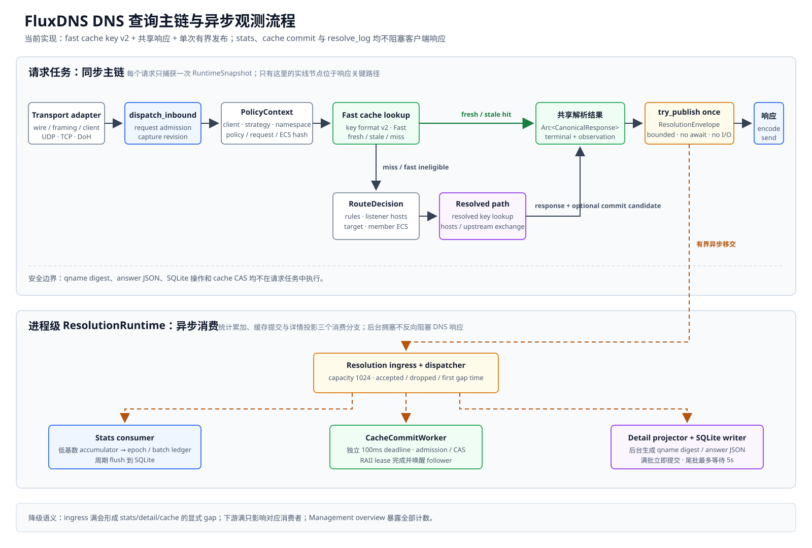

# DNS 请求管线实现

> 文档状态：有效
>
> 适用范围：正式 transport、Policy、Cache、Upstream 与单次完成事件链路
>
> 最后核对：2026-09-05（构造入口、关键分支与异步移交静态核对）
>
> 核对基线：`8223d819efb83fed642900e6b121825083e8c1dd`

## 入口与调用链

[`service.rs`](../../../backend/src/service.rs) 根据 typed binding 启动 UDP、TCP 和 DoH task；`run_adapter_loop` 把 adapter 产出的请求交给 instrumented core，再编码写回。TCP/DoH listener 用内部 `JoinSet` 管理 session，不把 DoH 当成 raw DNS/TCP。

```text
SystemSocketFactory / typed binding
 -> transport adapter -> DnsRequest + RequestContext
 -> instrumented DnsCore::resolve_with_completion
 -> PolicyDnsCore -> PolicyContext -> fast cache
 -> miss: RouteDecision -> hosts / resolved cache / UpstreamRegistry
 -> canonical response + completion
 -> ResolutionEventSink::try_publish -> transport response encoding
```

[`transport/wire.rs`](../../../backend/src/transport/wire.rs) 分离请求 DNS ID 与 canonical message；response encoder 恢复本次 ID、TCP framing 或 DoH envelope，UDP 按 EDNS 尺寸截断副本，不污染共享缓存。



图中三个消费分支不表示三条额外下游队列；实际队列是 resolution ingress、cache commit 和详情投影，stats 由 dispatcher 直接累加，详见[后台服务](background-services.md)。

## Policy 与实际 core

正式 async prepare 在 [`dns/policy.rs`](../../../backend/src/dns/policy.rs) 构造 `PolicyDnsCore::from_config_with_resource_snapshots`；不是 [`ConfiguredDnsCore`](../../../backend/src/dns/configured.rs) 的较窄构造路径。`PolicyContext` 先选 client/strategy/cache namespace，Core 再结合 PolicyState 计算 ECS、eligibility 和 fingerprint；fast miss 后再求 `RouteDecision`，调用 [`policy`](../../../backend/src/policy) 的 client/strategy/route 逻辑。

配置 route 由 [`config/doh_route.rs`](../../../backend/src/config/doh_route.rs) 共享编译，DoH adapter 匹配真实路径后传 typed route ID，Policy 不重新匹配 URL。资源-only publish 更新 core 内的资源 snapshot，后续请求使用新 hash；不依靠全局 cache clear。

`dns/policy.rs` 同时含具体 adapter 的构造代码，包括 `UpstreamRegistry`、Moka 和 SQLite cache；解析方法通过 port 使用它们。不能把设计中的“公共接口不泄漏 adapter 类型”扩大为“整个 dns 源目录不 import adapter”。

client CIDR 按前缀长度降序扫描；hosts 使用 BTreeMap，rule exact/suffix 使用 BTreeSet，随后依次匹配 keyword/受限 regex。当前没有 CIDR/suffix trie。PolicyState 的 matcher/version/hash 一起发布，Runtime metadata 随后更新，不是跨两个 ArcSwap 的事务。

## Cache 与 TTL

`build_cache_facade` 的生产默认是 [`MokaCacheStore::with_max_weight`](../../../backend/src/cache/moka.rs)，不是测试用 [`MemoryCacheStore`](../../../backend/src/cache/memory.rs)。共享 store 通过 namespace 形成逻辑池；`cache/key.rs` 的 v2 编码隔离 Fast/Resolved。当前 fingerprint 包含 PolicyState 中全部 hosts/rule-set hash，不仅限于本请求依赖的资源；纯观测或整个 runtime revision 不直接作为全局失效维度。

- listener/strategy hosts 本地回答绕过 response cache；upstream hosts 按普通上游响应处理。
- group member ECS 在选择前不确定且无上层覆盖时，绕过 lookup、single-flight 和写入，避免只按 group ID 混用响应。
- 缓存候选使用 canonical upstream response 与 origin TTL；返回时递减 TTL 或应用 effective override。stale 返回受当前 pool 的 optimistic max age 与 answer TTL 限制。
- optimistic refresh 通过有界 finalizer 重新使用 core 的最新资源/策略决策，不复用 entry 保存的旧 connector。配置切换期间的候选和 owner 行为见 lifecycle/background 文档；不能把“最新资源”推断为所有 late-window 跨 revision 场景均已验收。
- Core 将持有 single-flight lease 的 `CacheCommitCandidate` 随完成事件交出；[`resolution.rs`](../../../backend/src/resolution.rs) 的 cache worker 在独立 deadline 内 CAS。candidate drop 必须唤醒 waiter，响应不等待写回。

持久化启用、恢复、队列和失败见[后台服务](background-services.md)；准入与终态约束见 [Cache 设计](../../architecture/backend/modules/cache.md)。

## Upstream 与出站

[`UpstreamRegistry::from_resolved_with_outbounds`](../../../backend/src/upstream/registry.rs) 在 core 构造时装配真实 connector；HTTPS 使用 [`ReqwestDohHttpTransport`](../../../backend/src/upstream/reqwest_http.rs)。[`tokio_outbound.rs`](../../../backend/src/upstream/tokio_outbound.rs)、[`socks5.rs`](../../../backend/src/upstream/socks5.rs)、[`bootstrap.rs`](../../../backend/src/upstream/bootstrap.rs) 提供系统 TCP、代理协商和 bootstrap 解析，Host/SNI 与连接目标保持各自语义。不是只有选择器或 fake、没有真实 I/O 的状态。

[`group.rs`](../../../backend/src/upstream/group.rs) / [`executor.rs`](../../../backend/src/upstream/executor.rs) 分离成员选择、首个 terminal response、fallback 与 late cache candidate。只有无 terminal response 才 fallback；late result 不改变已返回响应。主动健康检查和持久健康分数没有接入。

[`TokioDohAddressResolver`](../../../backend/src/upstream/http.rs) 每次 bootstrap resolve 发起 A/AAAA，未使用 `AddressResolutionState` 的 TTL cache。parallel 有 late sink 时将剩余任务移交 drain，Positive 首响应也不必然取消它们；无 sink 时非 Positive 终态不能保证立即返回。load-balance 统计 primary lease，失败后按配置顺序重试，不等同逐 attempt least-in-flight。具体语义见 [Upstream](../../architecture/backend/modules/upstream.md)。

## 能力与证据

| 能力 | 代码实现 | 正式入口接线 | 验证证据 | 已知限制 |
| --- | --- | --- | --- | --- |
| UDP/TCP/DoH | `transport/udp.rs`、`tcp.rs`、`doh.rs` | service 的 typed binding 与 session loop | 本轮静态；存在 `udp_tcp_and_plain_doh_follow_the_same_dns_contract` | 未重跑协议/真实网络矩阵；DoH 入站非 HTTP/2 |
| TLS / 客户端地址 | system socket TLS、DoH forwarded/PROXY parser | DoH accept 后先可信 PROXY、再 TLS、再 HTTP | 本轮核对生产分支 | 真实代理、证书和故障组合仍需环境验收 |
| Moka / SQLite cache | `build_cache_facade`、`initialize_cache_persistence` | async prepare 默认构造 | 本轮静态；测试构造与生产构造已区分 | last-access bucket、真实 disk-full 与部分 late-window 差距见[计划](../../plans/backend-contract-gaps.md) |
| Policy -> 出站 | core -> registry -> protocol-independent connector | 正式配置构造支持真实 HTTP/代理路径 | 本轮静态，无远程请求 | 不等同所有 SOCKS/Host/SNI 组合已实测 |
| 单次完成事件 | service instrumented core、resolution publisher | core 返回后、编码前无等待移交 | 本轮核对调用位置 | ingress 满会出现可观测 gap，不能承诺零丢失 |

源码中的单测/fake/本机 profile 只作为后续验证入口。本轮没有运行 Cargo、DNS smoke 或压力测试；性能不能引用旧阶段数字为新结果。
