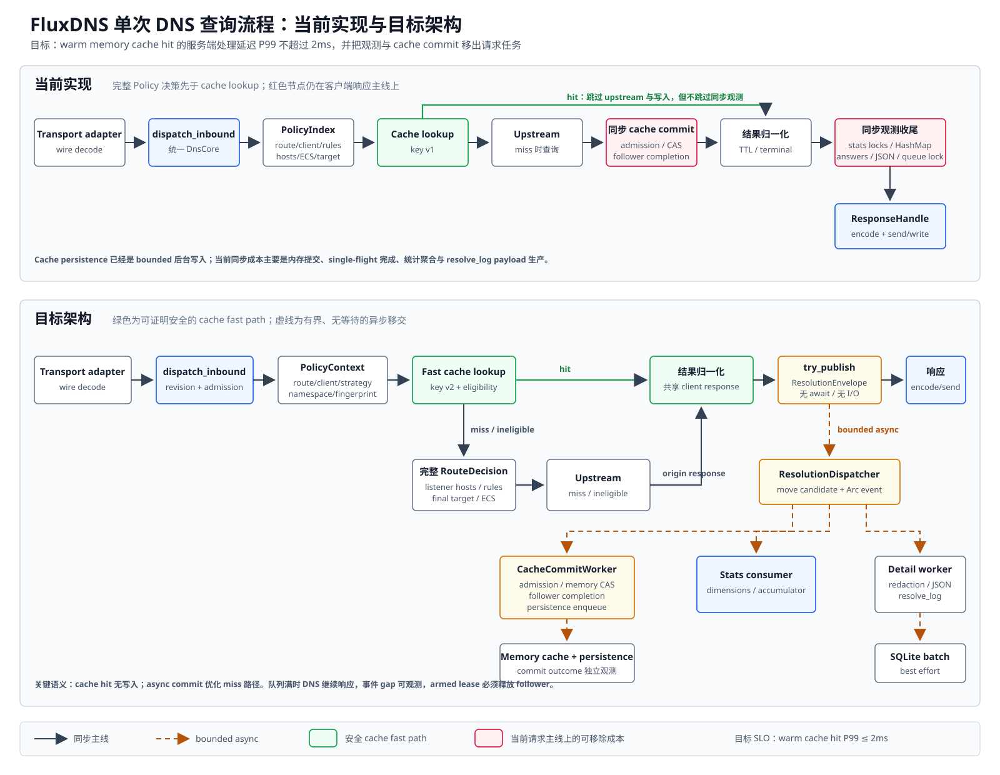
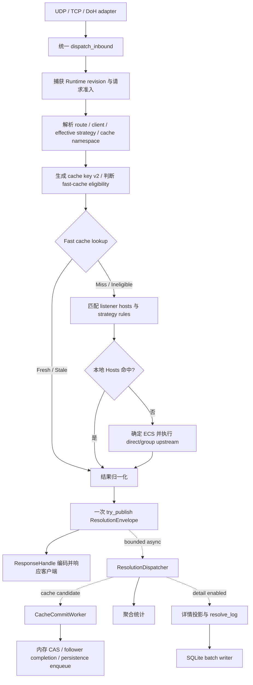

# DNS 查询主链异步观测重构方案

> 文档状态：草案
>
> 实现状态：未实现
>
> 适用范围：后端单次 DNS 查询的 Policy/Cache/Upstream 编排、规范化结果事件、聚合统计与 `resolve_log` 异步消费边界；不改变 UDP/TCP/DoH 协议契约和现有解析策略语义
>
> 最后核对：2026-09-04
>
> 关联文档：[后端总体架构](../backend/architecture.md) · [DNS Core](../backend/modules/dns-core.md) · [Policy](../backend/modules/policy.md) · [Cache](../backend/modules/cache.md) · [Storage](../backend/modules/storage.md) · [Ports](../backend/modules/ports.md) · [配置参考](../backend/configuration-reference.md)

## 1. 摘要

本方案的首要目标是缩短 DNS 主线，尤其让内存 cache hit 在目标负载下尽量达到服务端 P99 不超过 `2ms`。将聚合统计和 `resolve_log` 从同步收尾阶段迁移到统一解析事件的异步消费者是必要改动，能直接移除当前 `ObservedDnsCore::record` 中的统计维度构造、answer 字符串复制、JSON 大小检查和 `Mutex<VecDeque>` 入队对客户端响应延迟的影响。

需求不能按原始顺序直接实现，必须先修正两项契约：

1. **当前 v1 cache key 不能在所有规则匹配之前使用。** 它包含生效 strategy、最终 upstream target 和 ECS 指纹；listener hosts、strategy hosts、rule-set upstream 及 rule ECS 都会改变最终答案。要让 cache hit 真正跳过逐条规则匹配，必须升级为 cache key v2，并在 prepare 阶段为 route/effective strategy 计算覆盖所有答案依赖的稳定语义指纹；无法证明安全的请求继续走完整 Policy 路径。
2. **“不阻塞 DNS、内存有界、聚合统计绝不丢失”不能同时无条件成立。** 有界异步队列使用 `try_send` 时必然存在满队列分支。若 DNS 绝不等待或失败，则必须允许统计出现可观测 gap；若统计必须精确，则必须保留同步 fallback，或在无事件槽位时拒绝新请求。

本方案以数据面性能优先，推荐采用以下目标：

- 主流程仅构造一份轻量、typed 的 `ResolutionEnvelope`，并执行一次有界、无等待的 `try_publish`；
- producer 不执行 answer 字符串化、JSON 序列化、统计 HashMap 更新、Storage 锁或数据库调用；
- process-owned dispatcher 把同一 envelope 非阻塞分发给 cache commit、聚合统计和可选详情 worker；
- `resolve_log` 的字段校验、redaction、answer 裁剪和 JSON 构造全部移到详情 worker；
- upstream 结果规范化后，把可缓存的 origin response、key、provenance 和 single-flight leader lease 作为 `CacheCommitCandidate` 随同事件发布，由独立 worker 异步完成内存 CAS、follower completion 和既有 persistence enqueue；
- 事件 ingress 满时继续响应 DNS，同时累计明确的 `resolution_event_gap` 并标记 health degraded；这会把聚合统计从“已接收请求精确”调整为“正常运行精确、过载时存在显式 gap”，实施前必须确认该契约变化；
- Policy 先得到 route/client/effective strategy/cache namespace 和预编译的 `CacheSemanticsFingerprint`；满足 fast-cache 条件时立即 lookup，命中后跳过 hosts/rule/upstream 决策并进入结果归一化；miss 或不满足条件时再执行完整规则路径；
- cache key v2 以语义指纹隔离 route、strategy、hosts/rule resource、upstream/ECS 依赖，任何相关 snapshot 更新都会生成新指纹，旧条目不再可达并等待自然淘汰；
- 将 `2ms` 定义为可复现的服务端 cache-hit SLO，不承诺公网 RTT、TCP/TLS 首次握手、客户端调度或链路拥塞。

## 2. 当前实现基线

### 2.1 请求与解析路径

当前实现已经具备统一处理器的大部分基础：

| 阶段 | 当前实现 | 代码依据 |
| --- | --- | --- |
| 入站规范化 | UDP/TCP/DoH adapter 解码 wire，保存原 DNS ID，生成 `CanonicalQuery` 与 `RequestContext` | `backend/src/transport/wire.rs:36-47`、`backend/src/ports/inbound.rs:11-33` |
| 统一调度 | `dispatch_inbound` 调用 `DnsCore::resolve`，再通过唯一 `ResponseHandle` 编码响应 | `backend/src/dns/handler.rs:279-295` |
| Runtime 准入 | 每个请求绑定当前 revision，并由 `ActiveRuntime::try_acquire` 管理 drain/capacity | `backend/src/runtime/coordinator.rs:117-135` |
| Policy 规划 | 一次 `PolicyIndex::evaluate` 完成 route、client、strategy、cache、TTL、rules、upstream 与 ECS 决策 | `backend/src/policy/plan.rs:307-375` |
| Cache/Upstream | `PolicyDnsCore::resolve_upstream` 处理 bypass、fresh/stale、single-flight、上游交换和 cache admission | `backend/src/dns/policy.rs:801-1027` |
| 结果归一化 | question 不匹配或 transport failure 转 `SERVFAIL`，cancel 转 `NoResponse`，最后应用 client-visible TTL override | `backend/src/dns/policy.rs:751-798` |
| 同步观测 | `ObservedDnsCore` 在 inner Core 返回后同步调用 `record`，完成后才把结果交回 responder | `backend/src/service.rs:1095-1104` |

### 2.2 当前同步观测成本

聚合统计虽然不访问数据库，但仍在请求任务内完成：

- 构造最多八个 `StatsDimension`；
- 计算 UTC day 和 event sequence；
- 获取 `StatsAccumulator.active` 的 `RwLock` 读锁；
- 对 16 个 shard 之一获取 `Mutex`；
- 更新 totals/dimensions HashMap 并保存完整 `StatsEvent`。

对应实现位于 `backend/src/service.rs:1108-1176`、`backend/src/storage/statistics.rs:183-248`。

开启 `resolve_log` 时，请求任务还会同步执行：

- request digest 格式化及多个 ID/qname 的 owned 转换；
- 遍历并复制最终响应的全部 answer；
- 校验详情字段并计算 duration；
- 最多 16 次逐步扩大的 `serde_json::to_vec`，以限制 answer JSON 为 4096 bytes；
- 获取详情 `Mutex` 并写入 `VecDeque`。

对应实现位于 `backend/src/service.rs:1178-1249`、`backend/src/service.rs:1279-1295`、`backend/src/storage/resolve_log.rs:397-454`。SQLite 写入已经在后台执行，因此本方案解决的是同步 CPU、allocation 和锁竞争，不是把当前同步数据库 I/O 异步化。

### 2.3 开启 `resolve_log` 对查询速度的实际影响

结论是：**当前实现开启 `resolve_log` 必然增加客户端响应前的 CPU、allocation 和锁竞争，因而会影响查询速度；影响幅度尚无仓库内 benchmark 数据，不能仅凭代码给出微秒数。** 开关两种路径的差异如下：

| 状态 | 请求任务内实际行为 | 对延迟的含义 |
| --- | --- | --- |
| `resolve_log.enable=false` | `StorageRuntime::open` 不创建 detail sink/worker；`ObservedDnsCore::record` 完成 stats 后在 `resolve_event_sink=None` 处分支返回 | 不产生 request digest、qname 和 answer strings，不执行详情 JSON sizing，也不获取详情队列锁；同步 stats 成本仍然存在 |
| `resolve_log.enable=true` | 每次解析完成都构造完整 `ResolveEvent`，同步调用 `ResolveDetailRecord::from_event`，之后锁住 `VecDeque` 判断容量并入队 | 这些工作全部位于 `DnsCore::resolve` 返回给 `ResponseHandle` 之前，直接增加处理时间，并会放大 P99 尾延迟 |

主要成本和边界为：

1. `response_answers` 遍历最终 answer 并为 name/type/data 分别创建 `String`，成本随 answer 数量和文本长度增长；即使最终详情队列已满，这些 allocation 也已发生。
2. `bounded_answers` 最多保留 16 条 answer，并在每加入一条后对当前增长中的数组执行一次 `serde_json::to_vec`，最多重复 16 次；虽然有 4096-byte 上限，但在 cache hit 的纯内存短路径上仍是显著的相对开销。
3. `try_record_inner` 在构造和校验 `ResolveDetailRecord` **之后**才获取 `Mutex` 并检查 1024 条队列是否已满。因此过载丢弃只避免后续持久化，不会免除前面的字符串化和 JSON 工作；并发查询还会竞争同一队列锁。
4. SQLite transaction 不在请求任务内；当前请求只同步写入内存队列/内部 bounded channel。因此不能把全部影响归因于数据库，也不能通过 WAL 配置消除上述热路径成本。
5. 当前 `duration_millis` 在 `ResolveDetailRecord::from_event` 中先计算，随后才执行 answer JSON sizing 和队列加锁，而且 transport encode/send 尚未发生。它不能完整覆盖 `resolve_log` 自身收尾成本，也不能直接作为第 4.3 节 `2ms` SLO 的测量值。

上述事实分别由 `backend/src/storage/service.rs:278-302`、`backend/src/service.rs:1178-1227`、`backend/src/service.rs:1279-1295`、`backend/src/storage/resolve_log.rs:61-115` 与 `backend/src/storage/resolve_log.rs:397-454` 支持。预期影响在 cache hit、小 RTT upstream 和 answer 较多时最明显；真实 P50/P99 差值必须在阶段 A 用 `resolve_log=off/on` A/B benchmark 测量。

### 2.4 当前缓存顺序与约束

`PolicyIndex::evaluate` 内部先选择 cache namespace，再执行规则匹配，但真正的 cache lookup 必须等待完整 `ResolutionPlan`，原因是 cache key 当前包含：

- namespace；
- canonical query 与 transport compatibility；
- strategy fingerprint；
- 最终 upstream target fingerprint；
- 应用 rule/strategy/client/upstream/global 优先级后的 ECS fingerprint。

依据为 `backend/src/cache/key.rs:31-69` 与 `backend/src/dns/policy.rs:1328-1345`。此外，listener hosts 和 strategy hosts 必须优先于 response cache；存在 member-specific ECS 的 group 当前会直接绕过 cache。上述行为是现有正确性契约，不应在观测异步化任务中顺带改变。

当前 cache persistence 已经通过 `CachePersistenceWriter::enqueue` 使用 bounded `try_send` 异步执行；仍在请求路径上的主要是 response admission、内存 `CacheStore::compare_and_swap`、写后 `get` 和 single-flight `publish_load`。leader 在这些步骤完成后才返回上游结果，依据为 `backend/src/cache/service.rs:538-584` 与 `backend/src/dns/policy.rs:923-998`。因此“缓存写入异步化”主要指把内存 cache commit 和 follower completion 移出请求任务，不是重复实现已有的 SQLite persistence worker。

## 3. 需求合理性评估

| 需求 | 结论 | 说明 |
| --- | --- | --- |
| UDP/TCP/DoH 进入统一处理器 | 合理，且基本已实现 | adapter 已统一产出 `InboundRequest`，Core 与 transport framing 解耦 |
| 先解析客户端、入口策略、优先级和 namespace | 合理 | 可把 `PolicyIndex::evaluate` 的上下文决策显式拆出，便于测试和观测 |
| 只凭 namespace 先查缓存，再做规则匹配 | 有条件合理 | v1 key 不安全；只有 key v2 携带完整答案语义指纹、相关资源更新必然换 fingerprint、ECS 隔离可证明时才能开放 fast path |
| cache hit 跳到结果归一化 | 合理 | 当前 fresh/stale 命中已经避免上游 I/O；应继续经过 TTL、结果元数据和统一事件收尾 |
| 结果归一化后异步写入 cache | 合理，但会改变 single-flight 时序 | leader 可先响应；内存 entry 稍后可见，follower 必须等待后台 commit 或收到明确失败，不能遗留 lease |
| 规范化后只抛出一次统一解析事件 | 合理，推荐 | 能保证 stats 与详情基于同一次最终判定，不重复推测 source/cache/upstream |
| stats 与 `resolve_log` 都异步消费事件 | 合理，推荐 | 但两者可靠性不同，不能让详情拥塞拖慢 stats 消费 |
| 完全不阻塞查询 | 只能定义为“无 await、无阻塞锁、无 I/O” | `try_publish`、少量标量复制和原子操作仍有固定成本；任何“零成本”表述都不准确 |
| 队列满时 DNS 继续服务 | 与性能目标一致 | 代价是聚合统计可能出现显式 gap；不能继续宣称所有已响应请求都有精确统计 |

### 3.1 必须冻结的取舍

异步事件 ingress 有三项互相制约的目标：

```text
DNS 永不因观测等待或失败
        +
事件内存严格有界
        +
每条聚合统计绝不丢失
```

在进程内队列模型中最多同时无条件满足其中两项。本方案推荐“DNS 不等待 + 内存有界”，并用 gap counter、health 状态和管理面字段显式表达丢失。若项目要求精确统计，则应改选以下任一方案：

1. 请求开始前 `try_reserve` 一个事件槽位；没有槽位时拒绝新 DNS 请求；
2. 满队列时回退到当前同步 `StatsAccumulator`；
3. 引入持久化 WAL/spool 并接受 producer I/O、额外故障边界和磁盘配额。

方案 1 会把观测可用性变成 DNS admission 条件，方案 2 不能彻底移除统计热路径，方案 3 明显扩大本阶段范围，因此均不作为默认实现。

## 4. 目标与非目标

### 4.1 目标

1. 请求任务在结果规范化后只执行一次有界 `try_publish`，不直接调用 `StatsPersistenceWorker` 或 `ResolveLogWriter`。
2. stats 和 `resolve_log` 复用同一份 client、strategy、rule、cache、upstream 与 terminal result 判定。
3. 详情未开启时，不为 qname、client IP 或 response answer 保留详情 payload。
4. 详情开启时，producer 与消费者共享规范化响应，不深拷贝全部 answer。
5. stats ingress、详情投影和 SQLite 写入分别有界，详情拥塞不能阻塞 stats 消费。
6. 通过 cache key v2 的语义指纹，在可证明安全的 cache-hit 路径跳过逐条 hosts/rule/upstream 决策。
7. 保留现有 Policy、Hosts、Cache、ECS、Upstream、TTL 和 transport 响应语义；资源或配置变化可以降低命中率，但不能产生错误命中。
8. 在明确的 benchmark profile 下，使 warm memory cache hit 的服务端 P99 尽量不超过 `2ms`。
9. upstream miss 的主线不等待 cache admission、内存 CAS、写后读取、single-flight completion 或 persistence enqueue。
10. 用 benchmark 证明 cache-hit/hosts-hit/upstream-miss 热路径的吞吐与尾延迟得到改善，而不只依据调用图判断。

### 4.2 非目标

- 不在本阶段新增用户配置或改变默认值；`resolve_log` 的域名、客户端、策略、upstream 与 answer 内容保持不变，cache 字段按第 6.2 节拆分 lookup 与 commit 语义。
- 不把每个 parallel upstream attempt 都升级为一次查询事件；每个客户端请求仍只统计一次。
- 不用事件表达 transport encode/send 是否成功；解析完成事件与客户端交付事件是不同语义。
- 不引入 Kafka、外部消息队列、跨进程事件总线或新的长期依赖。
- 不把整个 `RuntimeSnapshot` revision 直接放入 cache key；只对会改变 DNS 答案或匹配结果的依赖计算 fingerprint。
- 不承诺公网客户端观察到的端到端 RTT 小于 `2ms`。
- 不在没有 benchmark 证据时重写 matcher、CacheStore 或 upstream executor。

### 4.3 `2ms` SLO 口径

`2ms` 按服务端处理时间定义，避免把后端无法控制的网络因素混入验收：

- 起点：adapter 已收到完整 UDP datagram、TCP frame 或 DoH request body，准备进入 DNS wire decode；
- 终点：UDP `send_to` 或 TCP/DoH response `write` future 完成；
- UDP 包含 wire decode/encode 与一次 socket send；
- TCP/DoH 只测试已建立并复用的连接，不包含 TCP connect、TLS handshake、HTTP connection setup 或客户端网络 RTT；
- cache 已预热，资源和 Runtime snapshot 稳定，无 reload、shutdown 或故障注入；
- 验收指标使用 P99，同时报告 P50/P95/P99.9、throughput、CPU 和 allocation/query；
- 目标 QPS、并发数、CPU 型号、操作系统和 build profile 必须在阶段 A 固化，否则 `2ms` 结果不可复现。

设计目标为 `P99 <= 2ms`。若某一 transport 在目标平台无法达到，应输出分阶段耗时，证明瓶颈属于 wire/transport、Policy/Cache、事件发布还是 runtime 调度，再决定是否接受例外；不得通过缩小请求样本或排除慢请求伪造达标。

用户提供的 AdGuard Home 查询日志截图中，同一批 DoH 请求显示约 `0.05ms`、`0.06ms` 和 `0.14ms` 的处理时间，可作为“毫秒内程序处理是现实目标”的量级参照。但截图未显示 cache-hit 标记，也未给出计时起止点、机器负载和 percentile，因此不能作为与 FluxDNS `2ms` SLO 等价的 benchmark 证据。

## 5. 目标查询流程

下图把当前实现中的同步收尾成本与目标异步边界放在同一张图中；SVG 源文件为 [`dns-query-pipeline-async-observation.svg`](dns-query-pipeline-async-observation.svg)。



下列 Mermaid 图只保留目标流程的机器可读拓扑，语义以正文约束为准：



图中的虚线表示异步消费。`try_publish` 本身仍发生在请求任务内，但必须满足：无 `await`、无阻塞锁、无字符串序列化、无数据库访问、固定次数原子操作。

### 5.1 Fast cache 的正确性条件

为满足 cache hit 的 `2ms` 目标，目标顺序调整为：

```text
PolicyContext
  -> CacheSemanticsFingerprint + fast-cache eligibility
  -> CacheKey v2 lookup
       hit -> normalize
       miss/ineligible -> RuleDecision / HostsDecision / effective ECS -> upstream
```

这条 fast path 只有同时满足以下不变量时才允许命中：

1. fingerprint 覆盖 route/listener、effective strategy、ordered rules、listener/strategy hosts、rule-set content version、所有候选 upstream identity 和会影响 ECS 的配置；
2. Resource refresh 与 Runtime reload 在发布新 `PolicyIndex` 前同步生成新 fingerprint，不能出现新 matcher 配旧 fingerprint；
3. 同一 fingerprint、同一 canonical query 和同一必要 client/ECS 维度必然得到同一 local/upstream 路由语义；
4. 当任一规则可能使用 client-derived ECS 时，key 必须包含规范化客户端子网 fingerprint，即使特定 qname 最终没有选择该 ECS；允许保守降低共享率，不允许跨客户端错误命中；
5. 存在选择后才能确定的 member-specific ECS、无法稳定摘要的动态依赖或未知 key 兼容性时，`fast_cache_eligible=false`，回退完整 Policy 路径；
6. matcher 若读取 canonical query 之外的 client、transport 或 request metadata，对应规范化请求维度必须进入 key；无法枚举或稳定编码时必须标记 ineligible；
7. key format version 必须升级，旧持久化 cache 不能被 v2 fast path 读取。

listener/strategy hosts 仍保持最高优先级：在同一个 fingerprint 下，如果 qname 会命中 hosts，就不可能由完整路径写入 upstream cache entry；hosts/rule resource 内容一旦变化，fingerprint 必须变化。因此 fast cache 可以位于逐条 matcher 之前，但不能只使用 namespace 和 qname。

## 6. 统一解析事件设计

### 6.1 事件职责

现有 `ResolveEvent` 是面向 SQLite 详情的重 payload，`DnsResolutionObservation` 是 Core 内部的低基数补充，两者应收敛为一个规范化完成事件。缓存提交需要转移 single-flight leader lease，不能放入可任意 clone 的事件本体，因此 producer 实际发布的是一次性 `ResolutionEnvelope`。建议沿用现有 port，不新增平行事件体系：

- 将 `ResolveEvent` 重命名并收敛为 `ResolutionEvent`；
- 将 `ResolveEventSink::try_record` 调整为 `ResolutionEventSink::try_publish`，参数改为 `ResolutionEnvelope`；
- `StatsRecorder` 保留为后台 consumer 到 `StatsPersistenceWorker` 的内部 port，不再注入 `ObservedDnsCore`；
- `ObservedDnsCore` 改名为 `EventPublishingDnsCore`，只负责把 Core result 与 observation 组合为一次事件并发布。

### 6.2 建议数据契约

以下为语义草图，最终字段类型以实现时的现有 typed ID 为准：

```rust
pub struct ResolutionEnvelope {
    pub event: Arc<ResolutionEvent>,
    pub cache_commit: Option<CacheCommitCandidate>,
}

pub struct ResolutionEvent {
    pub request_id: RequestId,
    pub received_at_utc: SystemTime,
    pub resolved_at: Instant,
    pub runtime_revision: RuntimeRevision,
    pub transport: TransportClass,
    pub listener_id: Arc<str>,
    pub route_id: Option<Arc<str>>,

    pub client_bucket: Option<Arc<str>>,
    pub strategy_id: Option<Arc<str>>,
    pub matched_rule: Option<MatchedRuleObservation>,
    pub source: StatsSource,
    pub cache_lookup_status: CacheLookupStatus,
    pub upstream_target_id: Option<Arc<str>>,
    pub upstream_member_id: Option<Arc<str>>,
    pub upstream_used_id: Option<Arc<str>>,

    pub terminal: ResolutionTerminal,
    pub detail: Option<ResolutionDetailSource>,
}

pub enum ResolutionTerminal {
    Response {
        class: ResponseClass,
        rcode: u8,
        response: Option<Arc<CanonicalResponse>>,
    },
    NoResponse { reason: Option<CancelReason> },
    CoreFailure { class: CoreFailureClass },
}

pub struct ResolutionDetailSource {
    pub client_ip: Option<IpAddr>,
    pub question: CanonicalQuestion,
}

pub struct CacheCommitCandidate {
    pub key: CacheKey,
    pub condition: CacheCondition,
    pub origin_response: Arc<CanonicalResponse>,
    pub upstream: CacheUpstreamProvenance,
    pub observed_at: Instant,
    pub producer_revision: RuntimeRevision,
    pub leader_lease: CacheLoadLease,
}
```

约束：

- stats 所需字段必须全部位于事件公共部分，不读取 qname、answer 或原始 IP；
- `detail` 只在 `resolve_log.enable=true` 时创建；当前该配置 reload 已要求重启，因此 interest 可在进程启动时固定；
- request digest 的格式化、qname ASCII 转换、answer summary 和 JSON 序列化全部由详情 worker 完成；
- `ResolutionTerminal::Response.response` 只在 detail interest 开启时为 `Some`；关闭 `resolve_log` 时 stats 事件不持有大 response；
- `cache_lookup_status` 只描述客户端请求完成前已经确定的 `Disabled/Miss/Fresh/Stale/StoreUnavailable`，不能降级成含义不足的布尔值；
- 异步 cache commit 的 `Stored/Rejected/Conflict/Unavailable/Dropped` 由 `CacheCommitWorker` 作为独立低基数 outcome 记录；不得等待提交结果后再补写原始事件或详情记录；
- cache hit 时继续携带 cache entry 的 producer upstream provenance；
- `CacheCommitCandidate` 只为可缓存的 upstream success 创建；hosts hit、cache hit、failure 与 bypass 不携带 candidate；
- `CacheLoadLease` 必须保持一次性所有权，不能放进 `Arc<ResolutionEvent>` 或被多个 consumer clone；
- 事件的 Debug 输出继续只显示长度、存在性和低基数枚举，不泄露域名、IP、answer 或 request ID。

### 6.3 规范化响应共享

若 producer 为异步详情 worker 深拷贝 `CanonicalResponse`，开启 `resolve_log` 时仍会复制整个 DNS message，违背性能目标。推荐将最终响应所有权调整为共享只读值：

```text
Policy Core 验证 upstream response
  -> Arc<CanonicalResponse> origin_response
       └─ CacheCommitCandidate 异步 admission / commit
  -> 应用 client TTL override
       -> Arc<CanonicalResponse> client_response
            ├─ CoreOutcome / ResponseEncoder 只读编码
            └─ ResolutionEvent detail worker 只读投影
```

建议把 `CoreOutcome::Response` 与 `ResponseEncoder::encode` 的响应参数改为 `Arc<CanonicalResponse>`。当前 transport encoder 本来就会为恢复客户端 DNS ID clone 一份 hickory `Message`，因此共享 Core response 不会取消协议编码所需的副本，但可以避免为日志额外复制一次完整响应。

Cache admission 必须继续保存 TTL override 之前的 `origin_response`；client-visible event 和 transport 使用 override 之后的 `client_response`。没有 TTL override 时两者可以共享同一个 `Arc`；存在 override 时允许保留两份 response 表示，但不得把客户端 TTL override 写回 cache entry。

### 6.4 单事件语义

- 每个进入 Core 的请求最多发布一个 `ResolutionEnvelope`，其中最多包含一个 `ResolutionEvent` 与一个 cache commit candidate；
- 发布点位于 Policy Core 完成最终 `Response/NoResponse/CoreFailure` 归一化之后、`ResponseHandle.respond` 之前；
- cache hit、hosts hit、upstream success、SERVFAIL、timeout 和 cancellation 都使用同一事件类型；
- parallel 的 late result 只更新独立诊断；若仍允许 late result 写 cache，应走与请求完成事件分离的低优先级 cache commit port，不能发布第二个请求完成事件；
- leader 的 DNS 响应不等待 cache commit；相同 key 的 follower 仍等待后台 worker 发布 single-flight completion，或在 candidate 丢弃/失败时收到明确失败并按既有重试上限重新解析；
- leader 响应完成到后台 commit 完成之间存在短暂的 cache eventual-visibility window，这是异步 cache 写入换取主线延迟的明确契约；
- response encode/send failure 不回写该事件，因为它描述解析结果；如未来需要交付统计，应新增语义独立的 transport completion metric，而不是修改解析结果。

## 7. 异步消费与背压

### 7.1 处理拓扑

```text
EventPublishingDnsCore
       │ try_publish(ResolutionEnvelope)
       ▼
bounded resolution ingress
       ▼
ResolutionDispatcher               单消费者、无 I/O
       ├─ move CacheCommitCandidate ─► bounded cache commit queue
       │                                      ▼
       │                               CacheCommitWorker
       │                                      ├─ admission / memory CAS
       │                                      ├─ single-flight completion
       │                                      └─ persistence try_enqueue
       └─ Arc<ResolutionEvent> ───────► StatsAccumulator
                                              └─ try_send(detail Arc)
                                                        ▼
                                              bounded detail projection queue
                                                        ▼
                                              ResolveDetailProjector
                                                        ▼
                                              bounded SQLite writer
```

`ResolutionDispatcher` 只移动 candidate、clone 一次事件 `Arc` 并执行无等待分发。cache commit 与详情投影都不能在 dispatcher 上运行。Stats consumer 必须先更新 stats，再尝试分发详情；cache CAS、详情队列满、详情字段非法或 SQLite 不可用都不能阻塞 resolution ingress 的持续消费。

### 7.2 Ingress 满队列策略

推荐语义：

1. producer 调用 `try_publish`，不等待 capacity；
2. `Accepted` 时正常返回 Core outcome；
3. `DroppedQueueFull` 时仍响应客户端；
4. 返回的 envelope 就地释放；若其中有 `CacheCommitCandidate`，`CacheLoadLease` 的 RAII `Drop` 必须立即执行 abandon/release，使 follower 不会永久等待；
5. producer 只执行固定成本的 `resolution_event_gap`、`cache_commit_dropped` 原子计数，不构造日志字符串；
6. 首次、2 的幂次累计点或周期 health snapshot 由后台任务发布 `degraded`；恢复接收后发布 `healthy`；
7. 管理面同时展示 accepted、dropped、cache commit dropped 和 gap 起始时间，不能把缺失统计解释为真实零流量。

这会改变当前 `StatsRecorder` 的“容量不足不得丢弃”契约。实施时必须同步更新 Ports、Storage、Architecture、Management API 说明与测试；在该契约未获确认前，不应开始代码迁移。

### 7.3 队列容量

首轮不新增用户配置，使用内部常量并通过 benchmark 定容。容量必须同时满足：

- 能吸收目标峰值 QPS 下的调度抖动；
- 最坏情况下保留的 `Arc<CanonicalResponse>` 不突破明确内存预算；
- ingress、cache commit queue 与 detail queue 分开定容、计数和观测；
- 不能使用无界 channel。

可从现有 1024 条详情队列作为基线测试点，但不能直接把 1024 当作最终合理值。完整 DNS response 最大可接近 65535 bytes，按条数限制无法等价于字节预算；压测必须同时记录 queue length、response wire size 分布和进程 RSS。

### 7.4 详情批处理

当前 detail worker 只在 5 秒 storage tick 中提交一批、每批最多 128 条，正常调用节奏对应约 25.6 条/秒。异步事件改造后建议把详情 writer 调整为“batch 满或最长等待时间到达即提交”：

- batch size 继续使用 128；
- 5 秒只作为低流量最大等待时间，不作为吞吐节流器；
- SQLite transaction、年龄淘汰、软阈值和硬上限语义保持不变；
- stats checkpoint 与 detail transaction 继续通过现有 backend operation lock 串行化；
- SQLite 慢时 detail queue 按既有 best-effort 语义丢弃，不反向阻塞 resolution ingress。

### 7.5 异步 Cache Commit 与 single-flight

当前 `CachePersistenceWriter` 已经异步，新增 worker 负责的是此前仍在 leader 请求任务内执行的 admission、内存 CAS、写后读取和 `publish_load`。其契约如下：

1. Policy Core 取得上游成功响应后，先校验并形成 TTL override 之前的 `origin_response`，再把 key、write condition、upstream provenance、响应观测时间、producer revision 与已 armed 的 leader lease 封装为 `CacheCommitCandidate`；
2. candidate 随 `ResolutionEnvelope` 一次性移交，producer 不等待 cache worker，也不等待 persistence queue；
3. `CacheCommitWorker` 按现有 admission 和 CAS 语义提交内存 entry，随后发布 single-flight `Ready/Miss/Failed`，再沿用现有 bounded persistence `try_send`；常见 Inserted/Replaced 分支应直接复用已生成的 entry 发布 `Ready`，避免无必要的写后 `get`；
4. worker 成功发布 completion 后才 disarm lease；在 ingress 满、commit queue 满、worker cancel/panic 或 shutdown deadline 超时等路径，armed lease 的 `Drop` 必须释放 waiters；
5. follower 等待的是后台 commit completion，而不是 leader DNS response；commit 丢弃或失败时按现有 bounded retry 规则回到 lookup/leader 竞争，不允许无限等待或无限上游重试；
6. `CacheCommitOutcome` 单独记录 `Stored/Rejected/Conflict/Unavailable/Dropped`。请求完成事件和 `resolve_log` 只记录 lookup 时已知状态，不事后更新详情行；
7. cache commit queue 使用独立高优先级 lane，不能与 JSON/SQLite 详情共用队列或 worker；队列满时优先保证 DNS 响应和 follower 可释放，而不是同步 fallback 写 cache；
8. TTL 的 `inserted_at/expires_at` 基于 producer 捕获的 `observed_at` 计算，不能以 worker dequeue 时间重新起算；worker 使用独立、短且有界的内部 commit deadline，不复用即将到期的客户端请求 deadline，提交时已失效的 candidate 直接发布 `Miss`。

异步 commit 的收益主要位于 upstream miss 路径；warm cache hit 本来没有写入，因此 `2ms` cache-hit 目标不能归功于此改动。它还会引入短暂的 eventual visibility：leader 已收到响应时，新的 cache entry 可能尚未对后续非 follower 请求可见。阶段 A 必须测量该窗口和由此产生的额外 upstream 请求率。

## 8. Policy 与 Cache 调整

### 8.1 两阶段 Policy 结果

为使主流程职责清晰，可将当前 `PolicyIndex::evaluate` 内部拆为两个纯内存阶段，但对外仍只暴露一个稳定 facade：

```text
PolicyContext
  route + client match + effective strategy
  cache namespace + TTL override
  CacheSemanticsFingerprint + fast-cache eligibility

RouteDecision
  matched hosts/rule/resource
  local answer 或 upstream target
  final ECS + resolved cache dimensions
```

`CacheSemanticsFingerprint` 在 Policy/Resource prepare 阶段生成，不在请求路径遍历所有 rules 或资源内容。它应使用稳定编码和 SHA-256 等项目已有摘要能力，覆盖：

- listener/route identity 与 listener hosts dependency；
- effective strategy ID、规则顺序、规则类型和会影响路由的配置；
- hosts/rule-set 的 content hash 或等价稳定版本；
- 规则可选择的 upstream target/group identity 及相关 ECS 配置；
- 会改变答案的其他已解析策略维度。

dependency summary 还必须声明 matcher 会读取的 request-derived 输入；请求路径只对这些已声明字段生成稳定、无明文的 `RequestPolicyFingerprint`。它不包含与答案无关的日志配置、WebUI、数据库路径、Telemetry 或完整 Runtime revision。拆分不得重复 client/rule 匹配，也不得在请求路径读取 YAML、遍历资源内容或重新编译 matcher。

### 8.2 Cache 命中路径

推荐 fast path：

1. 解析 `PolicyContext`；
2. 根据预编译 dependency summary 计算请求级必要维度，例如 client-derived ECS subnet fingerprint；
3. 若 `fast_cache_eligible=true`，构造 cache key v2 并 lookup；
4. fresh/stale 命中后直接恢复 producer provenance，执行 TTL aging/optimistic refresh permit 和结果归一化；
5. miss 或 ineligible 才执行 listener hosts 与 strategy rules，得到 `RouteDecision`；
6. 本地 hosts 命中时直接回答，不写 response cache；
7. 其他请求确定 final ECS，执行 upstream 并持有 single-flight leader lease；
8. upstream response 校验后，使用与第 3 步相同的 v2 key 形成异步 `CacheCommitCandidate`；ineligible 请求使用 v2 的 resolved-key mode，显式编码最终 target/ECS；
9. 保留 TTL override 之前的 origin response 给 candidate，再应用 client-visible TTL override；
10. 规范化并发布 envelope 后立即进入 transport response，后台 worker 独立完成 cache admission、内存 CAS、follower completion 与 persistence enqueue。

建议 cache key v2 使用模式位区分两类安全 key：

```text
fast mode:
  namespace + canonical query + transport compatibility
  + CacheSemanticsFingerprint + RequestPolicyFingerprint
  + conservative ECS dimensions

resolved mode:
  namespace + canonical query + transport compatibility
  + policy fingerprint + selected target fingerprint + final ECS fingerprint
```

v2 上线后不读取 v1 持久化 entry，首次启动会出现预期的 cache cold start。相比尝试迁移无法证明语义完整的旧 key，冷启动更安全。新旧 format 仍可在磁盘上按现有淘汰机制自然清理。

Fast hit 不重新执行规则 matcher，但必须继续执行 TTL aging、stale permit、client-visible TTL override、统一事件发布和 transport encode。optimistic refresh 必须使用当前 snapshot 重新走完整 Policy 路径，不能只复用命中 entry 的旧 target。

## 9. 生命周期与 Runtime 边界

统一事件管线应是 process-owned，而不是跟随单个 Runtime revision 创建：

- 首次启动：Storage 打开并完成 migration 后创建事件 ingress、stats worker、cache commit worker 和可选 detail worker；消费者启动成功后才绑定 DNS listener；
- Runtime reload：新旧 `PolicyDnsCore` 共享同一个 publisher，事件保留各自的 `runtime_revision`；不因 reload 丢弃旧 Runtime 的 in-flight completion；
- 正常 shutdown：先停止 listener 并等待已准入请求结束，再关闭 publisher，依次 drain resolution ingress、cache commit queue 和 detail projection queue，最后执行 stats/detail/cache persistence/SQLite 的最终 flush；
- fatal shutdown：仍受统一 grace deadline 限制，无法排空时报告 accepted-but-unpersisted 与 dropped gap，不伪装为成功；
- `resolve_log` 配置变化继续保持 restart-required，本阶段不增加动态订阅切换。

## 10. 代码影响范围

| 文件/模块 | 计划变更 | 边界 |
| --- | --- | --- |
| `backend/src/dns/handler.rs` | 让规范化 response 可共享；保持 `dispatch_inbound` exactly-once 响应 | 不引入 Storage 类型 |
| `backend/src/dns/policy.rs` | 继续生成唯一 observation；上游成功后形成 cache candidate，不等待写入；在最终 TTL/terminal 归一化后形成共享 client response | 不直接记录 stats/detail，不执行 cache CAS |
| `backend/src/policy/plan.rs` | 拆分 `PolicyContext` 与 `RouteDecision`，prepare 时生成 cache dependency summary/fingerprint | 不改变规则优先级；请求路径不扫描 fingerprint 输入 |
| `backend/src/cache/key.rs` | 增加 key format v2 与 fast/resolved mode | v1 entry 不迁移为 v2，不允许跨格式命中 |
| `backend/src/cache/service.rs` | 提供 worker 可调用的 commit 操作，复用现有 admission/CAS/persistence enqueue | 不再由 DNS producer await；不重复创建 persistence worker |
| `backend/src/ports/cache.rs` | 保证 leader lease 可随 candidate 转移，所有 drop/cancel 分支都会 release follower | lease 不可 clone；不泄露具体 CacheStore 实现 |
| `backend/src/ports/storage.rs` | 将现有详情专用事件 port 收敛为统一完成 envelope、事件与 publish disposition | 不暴露 SQLx/Tokio receiver |
| `backend/src/service.rs` | `ObservedDnsCore` 改为轻量 publisher；装配并监督 process-owned dispatcher、cache commit 和 detail tasks | producer 不执行格式化、序列化、cache commit 或阻塞锁 |
| `backend/src/storage/statistics.rs` | 只由事件 worker 调用；保留 epoch/batch ledger | 不再由请求任务直接调用 |
| `backend/src/storage/resolve_log.rs` | 详情字段转换、answer 裁剪和 redaction 移入 detail worker | 队列满仍只丢详情 |
| `backend/src/storage/sqlite.rs` | detail worker 支持 batch-full/timer flush | 保留 transaction 与淘汰语义 |
| `backend/src/storage/service.rs` | 管理 event/detail worker 的 flush/shutdown 顺序和摘要 | 不把 DB future 放回 producer |
| `backend/src/management/*` | 暴露 event accepted/dropped/gap、cache commit outcome 与详情丢弃状态 | 不返回敏感事件内容 |

若实现中发现统一事件已不再属于 Storage 领域，可在同一阶段将 port 移至 `ports::observation`；不得同时保留 `ResolveEvent` 和 `ResolutionEvent` 两套可独立发布的生产路径。

## 11. 分阶段实施

### 阶段 A：冻结行为与性能基线

1. 为现有流程补齐 cache hit、hosts hit、upstream success/failure、timeout/cancel 的 completion contract tests。
2. 记录 `resolve_log` 关闭/开启时的 cache-hit、hosts-hit、大 answer 和 upstream-miss benchmark。
3. 固化第 4.3 节的 server-side latency 起止点、目标平台、QPS、并发数和 warm-cache 数据集。
4. 确认事件 ingress 满时允许聚合统计出现显式 gap；若不允许，改选第 3.1 节的精确统计方案。
5. 确认异步 cache commit 允许 leader 先响应、entry 稍后可见，并将 write outcome 与请求完成事件分离。

完成标准：当前功能语义与基准数据可重复，`P99 <= 2ms` 的测量口径和过载取舍有明确结论。

### 阶段 B：统一事件与共享 response

1. 收敛 `DnsResolutionObservation` 与现有 `ResolveEvent` 的字段来源，定义 `ResolutionEvent`。
2. 将最终 `CanonicalResponse` 调整为请求响应与详情 worker 可共享的只读值。
3. 保持 transport wire、DNS ID 恢复、UDP 截断和 cache TTL 语义不变。
4. 先用捕获型 fake sink 验证每个请求最多一条事件及字段完整性。

完成标准：仍可同步 fake 捕获事件，但 producer 已不生成 answer strings 或详情 JSON。

### 阶段 C：异步 ingress 与 stats consumer

1. 创建 process-owned bounded ingress、`ResolutionDispatcher` 和 stats consumer。
2. `EventPublishingDnsCore` 只执行 `try_publish`。
3. 把 stats dimensions 构造与 accumulator 更新迁入 worker。
4. 接入 accepted/dropped/gap health 与 shutdown drain。

完成标准：源码审查可证明请求任务不再调用 `StatsPersistenceWorker::record_request`，队列满不会 await。

### 阶段 D：异步 Cache Commit

1. 定义一次性 `CacheCommitCandidate`，将 origin response、key、condition、provenance、producer revision 与 leader lease 转移给后台 worker。
2. 把 admission、内存 CAS、写后读取、single-flight completion 和 persistence enqueue 移出 DNS producer。
3. 覆盖 ingress/commit queue 满、worker cancel/panic、CAS conflict、store unavailable 与 shutdown deadline 路径，证明 lease 总能释放。
4. 将请求事件的 `cache_lookup_status` 与后台 `CacheCommitOutcome` 分离，并接入低基数 health/metrics。

完成标准：leader 上游成功后不 await cache write 即可响应；follower 在后台 commit 成功、失败或丢弃时都能有界结束；现有 cache persistence 仍由原 worker 执行。

### 阶段 E：隔离详情投影与 SQLite batching

1. 创建独立 bounded detail projection queue。
2. 将 qname/request digest/answer summary/JSON 工作迁入 detail worker。
3. 详情 SQLite 改为 batch-full 或 timer 触发。
4. 删除失去职责的前置 `ResolveLogWriter` 队列，避免三层缓冲和重复 drop 语义。

完成标准：详情关闭时无 detail payload allocation；详情拥塞不拖慢 stats worker；SQLite 慢只形成 detail gap。

### 阶段 F：Fast cache key v2

1. 拆分/命名 Policy 上下文与规则决策阶段，在 prepare 时生成 dependency summary 与 `CacheSemanticsFingerprint`。
2. 实现 cache key v2 fast/resolved mode，明确拒绝 v1 persistence entry。
3. 先以 shadow assertion 比较 fast key 推导与完整 `RouteDecision`：同一 key 不得出现不同 hosts/upstream/ECS 语义。
4. shadow 验证通过后开启 fast lookup；ineligible 请求继续走完整路径。
5. 验证 resource refresh、Runtime reload、client ECS、rule ECS、member ECS 与 listener hosts 变更均不会错误命中。

完成标准：warm cache hit 不执行逐条 rule matcher，且完整正确性矩阵通过。

### 阶段 G：总体验收与文档收敛

1. 执行功能、reload、shutdown、故障和性能矩阵。
2. 在目标 profile 验证 cache-hit server-side P99 是否达到 `2ms`。
3. 将已稳定契约迁入 Architecture、Ports、DNS Core、Policy、Storage、Cache 与配置说明。
4. 删除本方案文档及索引项，Git 历史承担方案追溯。

完成标准：第 12 节全部门槛通过，长期权威文档与实现一致。

## 12. 验证与验收标准

### 12.1 功能与契约

- UDP/TCP/DoH 对相同 query 保持相同 canonical result；
- hosts 优先级、rule first-match、client strategy override 和 ECS 优先级不变；
- cache key 升级为 v2，v1 持久化 entry 不命中；fresh/stale、optimistic refresh 与 CAS 条件语义保持不变；single-flight 的 completion 从 leader 请求任务移到后台 commit worker；
- 任一 route/strategy/hosts/rule-set/upstream/ECS 答案依赖变化都会改变 fast fingerprint；无关配置变化不改变 fingerprint；
- fast key 相同的请求经完整 Policy shadow evaluation 后必须得到相同 hosts/upstream/ECS 决策；
- member-specific ECS 等不安全场景稳定回退 resolved path；
- cache hit 事件保留 producer upstream provenance；
- upstream success 事件记录 lookup 时已知状态，cache commit outcome 独立记录且不反向修改请求事件；
- leader 可以在 cache entry 可见前响应；相同 key follower 在 commit success/failure/drop 后均有界结束，lease 不泄漏；
- ingress 或 cache commit queue 满时 candidate 丢弃且 follower 被释放，不在 producer 上同步回退写 cache；
- upstream failure、SERVFAIL、NoResponse 和 cancellation 分类不丢失；
- 每个请求至多一条 completion event，parallel late result 不重复计数；
- `resolve_log.enable=false` 时 stats 正常，且不创建详情 payload/task；
- ingress 满时 DNS 响应不等待，event gap 与 health 可观测；
- detail queue 满或 SQLite Busy/Timeout/DiskFull 不影响 stats consumer 和 DNS；
- reload 前后的 in-flight 请求按各自 runtime revision 记录；
- shutdown 按 ingress → cache commit → detail → Storage/persistence 顺序有界排空。

### 12.2 性能

建议在同一机器、相同 build profile 和固定数据集下至少覆盖：

| 场景 | 变量 |
| --- | --- |
| cache fresh hit | `resolve_log` off/on，1 与高并发 |
| cache key path | v1 完整 Policy baseline、v2 fast hit、v2 ineligible fallback |
| hosts hit | 小 answer 与 16+ answer |
| direct upstream miss | 固定 mock RTT，对比同步 cache write baseline 与异步 commit，隔离本机 CPU 开销 |
| parallel group | 首个 positive 与 late result |
| event overload | consumer 暂停、ingress 满、恢复 |
| cache commit overload | commit worker 暂停、queue 满、follower 释放、额外 upstream 比例 |
| SQLite overload | Busy、短 deadline、detail queue 满 |

记录 QPS、CPU、allocation/query、P50/P95/P99、event publish 耗时、ingress/cache commit/detail queue high-water mark、event gap、cache commit outcome、follower wait、额外 upstream 比例、detail drop 和 RSS。

建议初始性能门槛：

- producer 路径静态检查不存在 JSON/answer 字符串化、Storage `Mutex/RwLock` 和数据库 future；
- warm memory cache hit 的 server-side P99 在冻结的目标 profile 下不超过 `2ms`；
- `resolve_log=off` 的 cache-hit throughput 相比重构前不得回退超过 3%；
- `resolve_log=on` 相比同版本 off 的 cache-hit throughput 和 P99 回退均不超过 5%；
- 目标峰值 QPS 持续 60 秒时 resolution ingress 不出现 gap；
- 人为暂停 consumer 时 DNS 延迟不随队列等待增长，满队列只增加 drop/gap 计数。

百分比门槛属于方案建议，阶段 A 应结合目标部署机器和预期 QPS 冻结最终值，不能用开发机单次结果直接作为发布结论。

### 12.3 建议命令

实现阶段从仓库根目录执行，Rust 版本按 `mise.toml`：

```powershell
cargo fmt --manifest-path backend/Cargo.toml --all -- --check
cargo test --manifest-path backend/Cargo.toml
cargo clippy --manifest-path backend/Cargo.toml --all-targets -- -D warnings
```

性能命令应在阶段 A 新增 repository-native benchmark target 后确定；本文不虚构尚不存在的 benchmark 名称。

## 13. 风险与缓解

| 风险 | 影响 | 缓解 |
| --- | --- | --- |
| event ingress 满导致 stats gap | 管理面计数低于真实请求量 | 显式 accepted/dropped/gap，health degraded，按目标 QPS 定容 |
| 大 response 被 queue 持有 | RSS 峰值上升 | 详情 interest gate、独立小队列、记录字节分布、快速投影后释放 `Arc` |
| detail CPU 拖慢 stats | ingress 积压 | stats consumer 只做统计并非阻塞 fan-out；详情独立 worker |
| response 共享改动影响 TTL/cache | 错误污染 cache 或客户端 TTL | cache 保存 override 前值，event/transport 使用 override 后值；增加定向测试 |
| leader 响应早于 cache 可见 | 短窗口内后续请求再次访问 upstream | 独立高优先级 commit queue、测量窗口与额外 upstream 比例、按峰值定容 |
| cache candidate 丢弃或 worker 退出 | follower 卡住或重复上游 | armed lease RAII release、所有 cancel/drop 测试、bounded retry 与 dropped metric |
| 请求事件不再包含 write result | `resolve_log.cache_status` 语义变化 | 拆成 `cache_lookup_status` 与独立 `CacheCommitOutcome`，同步 API/schema/文档 |
| shutdown 顺序错误 | 已接受事件未落盘或 task 悬挂 | process-owned 生命周期和分层 drain summary |
| fast fingerprint 漏掉答案依赖 | hosts/rule/ECS 错误命中 | prepare 阶段稳定编码、key v2、shadow assertion、依赖变化矩阵与不安全场景 fallback |
| key v2 导致升级后 cold cache | 短期 upstream QPS 和延迟升高 | 明确拒绝不安全迁移，发布窗口预热并观察 upstream 容量 |
| `2ms` SLO 口径漂移 | 不同环境结果不可比较 | 固化起止点、硬件、连接状态、QPS、并发、数据集与 build profile |
| 异步事件重排 | 时间序列与 request 完成顺序不同 | 用 request ID/runtime revision 关联；stats sequence 在单 consumer 内分配 |

## 14. 文档同步与退出条件

本方案是待评审的临时实现依据，不替代当前有效架构。实施完成后必须：

1. 更新 `docs/backend/architecture.md` 的请求管线、故障矩阵和事件 port；
2. 更新 `docs/backend/modules/dns-core.md`、`policy.md`、`ports.md`、`storage.md` 和必要的 `cache.md`；
3. 若 stats gap 与异步 cache outcome 契约获批，更新 `docs/backend/configuration-reference.md`、Management API schema/说明与 `config-example.yaml` 中直接受影响的文字；
4. 在 `docs/backend/development-plan.md` 记录里程碑和验收证据摘要；
5. 将稳定事实迁入上述权威文档后删除本文，并从 `docs/plans/README.md` 移除索引项。

进入代码实现前需要确认两项决策：

1. **事件 ingress 满时，是否接受“DNS 继续响应、聚合统计产生显式 gap”的性能优先语义；**
2. **是否接受 leader 先响应、cache entry 稍后可见，并把 cache write outcome 从请求完成事件中拆出的异步提交语义。**
