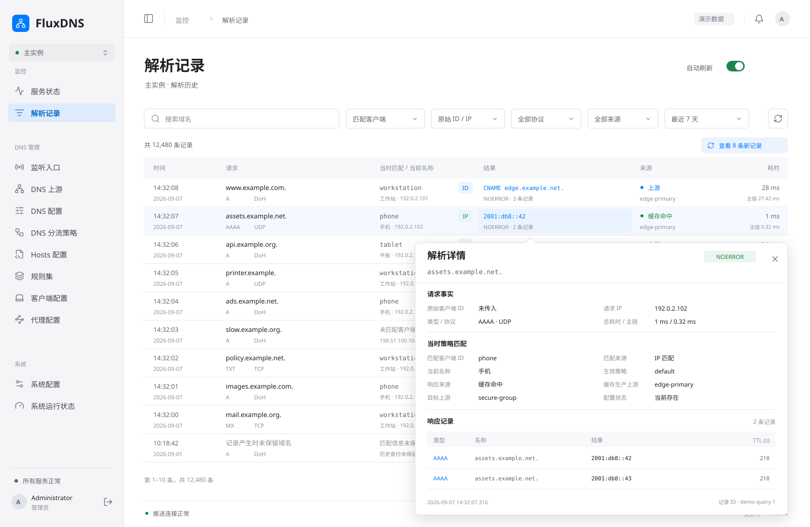

# WebUI 管理后台重构需求

> 文档状态：草案
>
> 适用范围：WebUI 管理后台的功能范围、页面组织、交互风格及后端配套需求
>
> 计划状态：待评审
>
> 代码基线：`56874aab35ff4bc94b3ad84e8f9fc012bb682cb8`（仅静态核对现有页面入口与管理 API 的只读边界）

## 1. 背景与目标

当前 WebUI 是临时性的只读浏览界面，需要升级为能够查看运行状态、浏览解析记录并按模块管理配置的后台。现有页面与接口入口见 [App](../../frontend/src/app/App.tsx)、[Management 查询路由](../../backend/src/management/query.rs) 和 [OpenAPI](../../frontend/openapi/management-api-v1.yaml)；首次初始化、登录和登出不属于这里所说的只读查询。

本文维护需求与视觉草案；配套的[后端重构方案](webui-management-backend-refactor.md)负责客户端身份、缓存快照、历史保留及管理接口的实施设计。两者目前均待评审，本轮不实现前端代码，也不修改后端代码或现有接口契约。

详细实施安排见[开发总计划](webui-management-development-plan.md)、[前端开发计划](webui-management-frontend-development-plan.md)和[后端开发计划](webui-management-backend-development-plan.md)。总计划维护跨端依赖、评审门槛和阶段性 Git 提交顺序，子计划维护任务、图稿/源码映射、验证与各自提交检查点；新增计划不表示本需求已获批或已经实现。

## 2. 总体要求

- 配置按业务模块查看和编辑，使用面向具体配置项的表单，不提供直接编辑整个配置文件的页面。
- 配置类模块原则上具备配置能力；状态和记录类模块用于观测，系统配置模块的可写范围单独限制。
- 本次重构属于破坏性更新，不兼容旧 WebUI 的数据逻辑；允许在后续实施中推翻原有设计并删除被替代的代码。本轮不执行这些修改。
- 前后端共同满足管理后台需求，缺少的数据查询、配置编辑和实时推送能力由后端同步补充。

## 3. 一级模块

各模块作为一级菜单入口，列表、配置概览或运行状态在对应一级页面展示。

| 模块 | 需求范围 |
| --- | --- |
| 服务状态 | 首期仅展示当前内存占用、最近 1 分钟的平均 QPS、最近 10 分钟的平均 RPM、在线客户端数，以及合并的 QPS/RPM 趋势图；在线客户端指最近 1 分钟内有请求的客户端。使用 WebSocket 接收后端实时推送，不展示 WebSocket 连接、通道或推送状态，也不展示监听入口等其他模块的摘要。保留简洁布局，后续按实际需要增加信息。 |
| 解析记录 | 查看解析记录列表，默认按时间倒序；结果列显示响应摘要，鼠标悬浮可查看该条记录的解析详情。支持开启自动刷新，开启后建立 WebSocket 连接，由后端定时推送新增解析请求记录；关闭后停止该页面的自动更新。 |
| 监听入口 | 查看已配置的监听入口，包括 DoH 等入口、启用状态、策略和 ECS 等配置；支持按入口查看和编辑配置。 |
| DNS 上游 | 查看上游及上游组（upstream group）列表；支持编辑各个上游的配置，包括类型和名称，并提供上游组的配置管理入口。名称为唯一标识，修改名称时必须同时向后端发送旧名称以定位原上游。 |
| DNS 配置 | 查看和编辑全局缓存、ECS、统计数据保留等配置；解析详情记录仅保留开关，保留策略统一归入统计数据。 |
| DNS 分流策略 | 查看策略列表，并提供对应策略的配置编辑入口。 |
| Hosts 配置 | 查看和编辑配置中的 hosts 列表。 |
| 规则集 | 查看和编辑规则集列表及其配置。 |
| 客户端配置 | 客户端 ID 是唯一标识，名称仅用于显示；保留可选 IP/CIDR 匹配与客户端策略覆盖。 |
| 代理配置 | 查看和编辑代理出口列表及其配置。 |
| 系统配置 | 查看 `logs`、`database`、`webui`、`work` 等系统配置；目前仅允许修改 `logs`，其余系统配置只读。 |
| 系统运行状态 | 展示进程运行时长、内存占用、当前线程数等进程信息。 |

服务状态侧重 DNS 服务的近期业务指标和实时变化；系统运行状态侧重进程自身信息。两处内存信息应保持口径一致。

## 4. 页面与交互要求

- 一级页面负责列表浏览和概览展示，对应配置编辑采用二级弹窗，不进入整份配置文件编辑器。
- 不同配置类型使用定制化弹窗，字段、控件和组织方式应适配该类型，不以一个通用配置文本弹窗替代。
- 整体视觉与交互效果参考苹果生产级界面，强调清晰层级、克制呈现和操作一致性；各模块统一导航、列表、表单、弹窗及状态反馈风格。
- 区分可编辑与只读内容；保存成功、校验失败及连接异常等状态应有明确反馈。
- 服务状态的 QPS 和 RPM 在同一张图中使用折线展示，共用时间轴，以不同颜色、线宽、面积底色、图例标记及明确单位区分两个指标；不得把不同统计窗口或单位当作同一组数值。正常态不展示 WebSocket 状态，数据过期或获取失败时仅给出面向业务的数据异常反馈，避免将旧数据误认为当前状态。
- DNS 上游编辑弹窗的名称使用可编辑输入框，类型使用可切换的选择控件；切换类型后展示对应类型的配置表单。旧名称由编辑会话保留，不要求用户重复填写，也不得被名称输入框的新值覆盖。
- 解析记录的自动刷新开关、WebSocket 连接状态和推送异常应可辨识，避免把连接中断误认为没有新记录。
- 解析详情采用锚定结果单元格的非模态浮层，不跳转页面、不压暗背景；鼠标从触发项移入浮层后保持显示，允许选择并复制文本，移出二者后再关闭。结果项同时支持键盘聚焦打开、`Esc` 关闭及点击/触屏查看，不能把悬浮设为唯一入口。浮层在视口边缘自动避让，内容过长时限制高度并在内部滚动，关闭后保留当前列表位置。
- 查看解析详情期间，自动刷新继续接收记录，但暂缓插入或重排当前列表，以记录 ID 固定详情对象，并显示待更新数量；不得因新增记录而替换鼠标下的内容。详情关闭后再恢复列表更新，点击“查看新记录”时先收起浮层再更新；具体缓冲上限、分页和断线后的补齐方式留待详细设计。
- 客户端普通编辑中 ID 只读，名称与 IP/CIDR 可修改；ID 优先、未命中时最长 IP/CIDR 回退的策略行为保留。IP 匹配不能被呈现为请求实际传入的 ID。
- 解析详情分开呈现“请求事实”“当时策略匹配”“响应记录”。原始 ID/IP 与请求时的最小匹配结果保持不变；名称明确标为当前名称，不将当前 IP 规则应用到历史记录。
- 缓存仅设置共享内存预算、可选二进制快照路径与覆盖周期，不设置持久化大小配额。缓存独立于统计和详情存储，清理缓存不删除业务历史。
- 统计数据提供 1、3、7、30 天及自定义天数、额外宽限期和详情文件参考大小。统计与详情共用清理截止日，服务器时间每天 01:00 执行；界面同时标注服务器时区和 UTC 自然日口径。参考大小不作为硬磁盘上限。

## 5. 后端配套与边界

- 提供各模块所需的配置查询和受限编辑能力，以及服务指标、解析记录、进程信息的数据查询能力。
- 提供服务状态实时推送与解析记录定时增量推送所需的 WebSocket 能力。
- 配置编辑需有后端校验、保存结果和失败反馈；系统配置仅 `logs` 可写的限制必须由后端落实，不能只隐藏前端编辑入口。
- 上游改名保存需同时携带旧名称与编辑后的配置；后端按旧名称定位原上游，并校验新名称的唯一性，不能按新名称误建一条上游。具体请求字段与改名涉及的引用处理在后续详细设计中确定，本轮不修改现有 API。
- 请求详情采用“原始 ID/IP＋最小匹配结果”，分别保存实际 ID、请求 IP、匹配客户端 ID 和 ID/IP/无匹配来源，不保存客户端名称或完整配置。UDP/TCP 未传入 ID 时原始字段始终为空，IP 策略匹配结果另存。
- 缓存持久化改为内存池的定期非 SQLite 快照，恢复失败可冷启动；统计和详情采用独立业务存储。统一保留与按日回收的方案、迁移限制、失败语义和测试要求见[后端重构方案](webui-management-backend-refactor.md)。
- “不兼容旧数据逻辑”不等于授权清空用户配置、数据库或运行数据；是否涉及这些内容，需在后续设计中单独明确。
- 本文不规定 API 路径、请求字段、WebSocket 消息格式、前端技术选型、组件结构或配置写入实现。

## 6. 后续设计与验收方向

需求及配套后端方案确认后，再展开前端详细设计与分阶段实施。后续仍需明确 QPS/RPM 的计算、采样和聚合口径、在线客户端识别方式、推送周期与断线行为、上游改名的引用处理和类型切换的字段校验，以及配置保存后的生效方式；后端方案中的提案不作为已有实现描述。

后续交付按以下要点验收：

1. 12 个一级模块齐全，模块职责与可写范围符合本文。
2. 配置通过模块化表单和定制化二级弹窗编辑，不直接编辑整个配置文件。
3. 服务状态支持实时推送，但不展示 WebSocket 状态或监听入口摘要；QPS/RPM 使用同一张折线图。解析记录保持默认时间倒序，并能开启、关闭基于 WebSocket 的自动刷新。
4. 系统配置仅 `logs` 可修改，其余系统配置在前后端均保持只读。
5. 各模块风格统一，后端提供真实数据与配置能力，不以静态展示代替管理功能。
6. DNS 上游的类型和名称均可修改；改名保存时携带旧名称与新配置，后端定位原上游并校验名称唯一性，保存失败时不丢失原名称。
7. 解析记录结果列可悬浮查看详情，支持键盘与触屏替代入口；浮层不遮挡触发项，自动刷新期间详情对象保持稳定。答案截断、空 Answer、超时和历史未保留等情况必须明确区分，不能以空白或零值掩盖信息缺失。
8. 客户端名称可重复，ID 为唯一键；IP 匹配继续影响策略，但不回填原始 ID。历史匹配结果不会因改名、修改 IP 或删除配置而重算，旧数据未知状态不冒充未匹配。
9. 缓存快照与业务历史独立；不出现缓存持久化配额或详情记录数上限。统计与详情使用同一份保留策略，详情关闭不停止统计或既有历史清理。

本文及附图不代表上述功能已完成详细设计、实现或运行验收。未来实施完成后，按[文档维护规则](../rules/documentation-maintenance.md)更新设计和实现文档，并移除本活动文档、附图及索引项；仍有设计价值的附图随已接受设计一并维护。

## 7. 视觉草案

以下 29 张 SVG 覆盖 12 个一级模块，沿用同一套界面风格：浅色图使用浅灰侧栏、白色工作区、蓝色主操作和克制的状态色；服务状态另提供布局与演示数据完全一致的深色图，以中性炭灰底色、分层灰度及适配深色背景的蓝色和青绿色评审深色风格。当前用于评审视觉方向，不是最终页面设计；源文件统一存放在[视觉草案目录](webui-management-designs/README.md)，可通过[本地评审总览](webui-management-designs/review.html)按模块查看并打开原图，无需启动服务。

图中指标、地址、分组和配置均为演示数据；按钮、筛选和表单为静态示意，不代表交互或接口已实现。

### 7.1 服务状态

仅展示一级导航、四项关键指标和一张 QPS/RPM 双折线趋势图，不再展示 WebSocket 状态或监听入口摘要；下方保持留白，不预填其他模块信息。图中顶部摘要分别使用最近 1 分钟平均 QPS 和最近 10 分钟平均 RPM；趋势图暂以最近 10 分钟为共同时间范围，QPS 示意秒级变化，RPM 示意逐分钟变化，左右轴分别标明请求/秒和请求/分钟。此展示草案仍需后续核定采样和聚合细节，不代表已有指标接口。

图表细节参考 [Apple Human Interface Guidelines：Charts](https://developer.apple.com/design/human-interface-guidelines/charts) 关于数据优先、克制网格、坐标范围和按需查看读数的指导。本图采用蓝色连续主曲线与低透明度面积填充、青绿色细辅助曲线、低对比实线网格，去掉逐点圆圈和交错虚线；仅在选中时刻显示圆形/菱形标记、垂直指示线及集中读数浮层。两条线保持共用时间轴和从零开始的双单位刻度，色彩不是唯一辨识方式；浮层为静态交互示意，不代表已经实现悬停或拖动。

本轮更换了演示序列以评审曲线层次，浅深模式的数据与几何完全一致。曲线连接不应越出相邻样本范围；后续真实指标的采样或降采样必须单独确定，并保留峰值和数据缺口，不能为了平滑外观抹掉异常、跨缺失区间补线，或将插值当成真实采样值。

### 7.2 服务状态 · 深色模式

与浅色图使用相同布局、数据和信息范围，单独用于评审背景层次、文字对比度、导航选中态和曲线辨识度。

### 7.3 DNS 上游

展示上游与上游组的浏览入口、搜索筛选、配置列表和行内编辑入口。

### 7.4 DNS 上游编辑

展示列表之上的定制化二级弹窗，当前类型为 DoH，包括可编辑名称、可切换类型、连接参数、代理出口和 ECS 配置。演示将 `edge-primary` 改为 `edge-main`；标题区保留原名称作为当前编辑对象，保存时需向后端同时发送旧名称 `edge-primary` 与新名称 `edge-main` 所属的新配置。该传参要求不是额外的用户输入项，具体请求字段留待详细设计。

### 7.5 解析记录列表

沿用浅色导航与无卡片包裹的列表布局，按时间倒序展示时间、请求、客户端、结果、来源和耗时。结果列以首条 Answer 的数据作为摘要，下方显示响应码、记录总数或失败/缺失状态；请求列收纳域名、类型和协议，耗时列区分服务端总耗时与 DNS 主链耗时。工具栏优先展示域名搜索、匹配客户端、原始 ID/IP、协议、来源和日期范围；响应码/结果状态保留为后续高级筛选，不因本图收敛主工具栏而取消。底部提供分页、推送连接状态和最近更新时间，不添加配置写入或删除记录操作。

客户端列第一行显示当时匹配的 ID 及 ID/IP 来源标记，第二行是当前名称和请求 IP；列头明确名称的当前语义，长名称截断后可查看完整文本。未匹配与旧版未记录分别显示。客户端筛选依据保存的匹配 ID，原始 ID/IP 单独筛选，不能按当前 IP 绑定重新归属历史记录。

上游及缓存记录在来源列保持两行结构：第一行标明“上游”“缓存命中”或“过期缓存”；第二行显示实际产生该答案的上游名称。命中缓存时使用 `upstream_used_id` 所记录的缓存生产上游，与普通上游响应保持相同排版，不以“缓存响应”替代名称，也不将上游组目标当作实际上游。该名称表示写入缓存时的来源，不代表本次请求再次访问该上游；记录缺失时明确显示“上游未保留”，不猜测或补造名称。Hosts、规则等本地响应的展示不受此要求影响。

图中同时包含正常答案、缓存命中、Hosts、规则负响应、超时、答案截断、过期缓存与历史脱敏记录，状态文字不只依赖颜色。用于对照的现有字段见 [QueryRecord / QueryAnswer](../../frontend/openapi/management-api-v1.yaml) 与 [QueriesPage](../../frontend/src/modules/queries/QueriesPage.tsx)；现有页面采用行展开，尚非图中的结果列悬浮交互。域名/客户端搜索与 WebSocket 自动刷新属于目标能力，现有 `/queries` 查询参数未包含该搜索条件，本轮不新增参数或实现这些能力。

### 7.6 解析记录悬浮详情

提供同一列表的两张详情图，分别评审 ID 匹配与 IP 匹配。触发单元格高亮，浮层在下方展开并用小箭头连接，列表其他区域不变暗；查看期间工具栏显示待更新记录数，当前行不移动。

第一张为 DoH：请求事实中的原始 ID 为 `workstation`，当时匹配 ID 同样为 `workstation`、来源为 ID；当前名称“工作站”另列。第二张为 UDP：原始 ID 明确为“未传入”，请求 IP 为 `192.0.2.102`，当时匹配 ID 为 `phone`、来源为 IP，不能将 `phone` 回填到原始 ID。这条记录命中缓存，`edge-primary` 标为缓存生产上游，不暗示本次访问上游。

两图将原始身份与类型/协议放在“请求事实”，匹配 ID/来源、当前名称、策略及上游决策放在“当时策略匹配”，Answer 类型、名称、数据和 TTL 独立成表；同时保留两种耗时、发生时间和记录 ID。第一张含一个 CNAME 与两个 A，第二张含两个 AAAA。

详情只展示后端实际保留的字段；现有响应是有界 Answer 摘要，不代表完整 DNS wire。`answers_truncated` 为真时明确展示已保留数与总数；`legacy_redacted`、空 Answer 和缺失耗时分别显示原因或未保留状态，不构造缺失内容。缓存命中/过期缓存的上游信息必须标为缓存生产来源，不能暗示本次请求调用了该上游。本图展示可用详情正常态，加载、获取失败、超长内容和触屏交互仍需后续详细设计与验证。

### 7.7 监听入口

[入口列表](webui-management-designs/webui-listeners.svg)区分逻辑入口、展开的监听地址和 DoH 共享路由；[UDP/TCP 编辑](webui-management-designs/webui-listener-editor.svg)展示地址、端口、策略和可选 Hosts，[DoH 编辑](webui-management-designs/webui-doh-listener-editor.svg)展示共享路由与端点列表，不把 DoH 扁平化为单地址、单策略。

ECS 展示配置层面的策略继承结果，不表示每次请求最终的 ECS；客户端和规则级覆盖仍可改变结果。当前 `ListenerDto` 没有独立的 `enable` 或 ECS 字段：图中“已启用”示意已配置且生效的入口，启停状态的数据来源及独立启停契约仍需后续设计，不能据此添加不存在的配置键。端点详情中的 TLS 材料、客户端 IP 来源、可信代理与错误策略，以及路由编辑的展开态未在本轮单独出图，仍按现有配置约束继续细化。

### 7.8 DNS 配置

[全局概览](webui-management-designs/webui-dns-settings.svg)分为缓存、TTL 与 ECS、统计数据、解析详情记录四个无外框分区，对应[缓存编辑](webui-management-designs/webui-dns-cache-editor.svg)、[TTL 与 ECS 编辑](webui-management-designs/webui-dns-policy-editor.svg)和[统计与数据保留](webui-management-designs/webui-statistics-editor.svg)。详情仅在概览保留开关，不再有独立的保留配置弹窗。

缓存编辑保留全局池、全部逻辑池共享的内存预算、乐观缓存参数；快照可选，配置 `.db` 二进制文件及覆盖周期，并只读显示最近快照和文件大小。删除持久化编码预算，不把文件大小作为硬配额；全局池开关不是全部逻辑池总开关，关闭快照也不关闭内存缓存。快照恢复失败允许冷启动，统计/详情不受缓存清理影响。

统计弹窗集中设置正常时间范围、额外宽限期和详情文件参考大小。预设 1、3、7、30 天，自定义选中后展开正整数天数输入；宽限期允许 0。演示值 7 天、3 天、1 GiB：清理时超过参考大小采用 7 天，否则采用 10 天，均包含当时的 UTC 日；不会为达到大小阈值删除有效期内数据。图中两档目标保留天数不承诺恢复此前已删除的日期，实际可查范围另由后端返回。

统计与详情共用一次清理的截止线，服务器时间每天 01:00 执行，图中同时显示 `Asia/Hong_Kong` 与 UTC 日期口径。缩短期限保存前预览影响并确认，清理失败与待回收空间分别显示。容量按 MiB/GiB 转为字节数；细节以[后端保留方案](webui-management-backend-refactor.md#6-统一历史保留)为准。当前详情开关仍需重启，新方案拟改为受控热应用，图稿不代表该能力已实现。

### 7.9 DNS 分流策略

[策略列表](webui-management-designs/webui-dns-strategies.svg)展示规则数量、默认上游和缓存/ECS 覆盖；[策略编辑](webui-management-designs/webui-strategy-editor.svg)以有序表格突出第一条命中即停止的匹配关系，保留顺序调整、添加和单条编辑入口。

Hosts 规则展示“本地回答”，不要求上游；规则集规则展示上游引用，二者不能同时配置。策略级缓存、TTL 和 ECS 单独表达继承关系，不能把“未配置”保存为显式禁用。单条规则与覆盖项展开后的完整编辑态仍需详细设计。

### 7.10 Hosts 配置

[Hosts 列表](webui-management-designs/webui-hosts.svg)区分内联和本地文件；[内联编辑](webui-management-designs/webui-hosts-editor.svg)以域名/IP 映射表替代整份配置文本编辑。图中同一域名的多条 IP 在保存时聚合为合法的 JSON 映射。

切换文件来源后需展示路径、自动重载及间隔，不能保留内联内容作为有效提交字段；文件自动重载不代表远程同步。本轮以 JSON 内联编辑为示例，文件来源和 Hosts 文本格式的编辑态尚未展开。

### 7.11 规则集

[规则集列表](webui-management-designs/webui-rule-sets.svg)展示来源、格式、刷新计划和快照状态；[远程规则编辑](webui-management-designs/webui-rule-set-editor.svg)展示 URL、下载代理、格式和定时更新。陈旧状态使用低饱和警示色，并明确仍使用有效旧版，不能把刷新失败误画成资源已被删除或首次加载成功。

切换内联、本地或远程来源时按类型展示并提交对应字段；`clash` 是行格式而非 YAML，`dat` 是二进制，不能统一塞进 JSON 编辑器。本轮没有新增版本锁定、校验和或主动刷新 API 的承诺；内联与文件编辑态留待细化。

### 7.12 客户端配置

[客户端列表](webui-management-designs/webui-clients.svg)以客户端 ID 为第一行、可选显示名称为第二行，单列展示 IP/CIDR、策略和覆盖状态。图中两个不同 ID 使用相同名称，明确名称不是唯一键。[客户端编辑](webui-management-designs/webui-client-editor.svg)将已有 ID 设为只读，名称可修改，IP/CIDR 作为可选重复输入行；缓存继承、独立池与禁用及乐观缓存、TTL、ECS 覆盖继续保留。

客户端 ID 改为单个必填唯一值，不再是数组；名称可重复，IP 列表可空，“未设置”不是提交值。精确 ID 优先，无 ID 或未命中时回退最长 IP/CIDR 前缀，保留 IP 对策略的影响，不增加拖动排序。相同规范化 CIDR 冲突在后端拒绝；不同长度前缀可以包含。IP 匹配按实际请求 IP 隔离独立缓存，不能按匹配 ID 将整个网段合并成一池。自定义 ECS、TTL 和乐观缓存时效的展开态仍需细化。

### 7.13 代理配置

[代理列表](webui-management-designs/webui-proxies.svg)展示 SOCKS5 协议族、SecretRef 来源和资源引用；[代理编辑](webui-management-designs/webui-proxy-editor.svg)在环境变量与文件引用间二选一，不显示或提交解析后的真实代理 URL、用户名、密码或令牌。

不将 SecretRef 来源当作代理可用性检测结果。`socks5`/`socks5h` 的目标解析差异仍由引用内容中的 scheme 决定，不增加与真实 URL 冲突的独立解析模式开关。

### 7.14 系统配置

[系统配置概览](webui-management-designs/webui-system-settings.svg)仅为日志保留编辑入口，数据库、WebUI 与工作目录使用锁形只读标记，不用禁用输入框暗示这些字段可以解锁修改。[日志编辑](webui-management-designs/webui-logs-editor.svg)只包含日志开关、级别和路径，并提示当前需要重启生效。

数据库只读分区同步展示统计数据库和详情日分片目录，与 DNS 配置中的缓存快照路径分开。该布局属于本轮后端提案，普通管理界面不开放这些业务存储路径的修改。

WebUI 公开 Origin 与 HTTP 监听分别展示，不能暗示管理服务本身终止 TLS。密码 hash 和凭据不进入图稿。只读限制必须在后端落实；本轮不设计系统重启按钮或其他系统写操作。

### 7.15 系统运行状态

[进程概览](webui-management-designs/webui-system-runtime.svg)展示运行时长、常驻内存、线程数、启动时间和版本，以简洁读数与信息行呈现，不重复服务状态的 QPS/RPM 图。页面不添加重启、停止或日志配置操作。

内存读数与服务状态保持相同演示值和口径。当前 `SystemInfo` 仅包含版本、启动时间、运行时长及管理能力，内存和线程数属于待补充查询能力；拿不到读数时应显示不可用而非零值。图中的采样时间、配置摘要、引用数量和状态同样不意味着已有对应 API。

### 7.16 上游组

[上游组列表](webui-management-designs/webui-upstream-groups.svg)补齐 DNS 上游页的“上游组”标签；[上游组编辑](webui-management-designs/webui-upstream-group-editor.svg)沿用可编辑名称和类型，分别组织主成员与回退成员、选择模式和超时，编辑会话同样保留旧名称。

并行与失败转移模式不展示可编辑权重；轮询和负载均衡模式才展开权重输入。回退仅在主组没有终态 DNS 响应时使用，不把 `NXDOMAIN`、`REFUSED` 或 `SERVFAIL` 当作必然触发回退的传输失败。成员选择、类型切换和空回退列表的完整编辑态仍需后续细化。

### 7.17 本轮覆盖与边界

此前补齐的 22 张图稿于 2026-09-05 静态核对 `f65fb3f8bd68e1a40ca041d9a380859b44a3da0c` 下的 [配置模型](../../backend/src/config/model.rs)、[配置参考](../implementation/configuration.md)和 [OpenAPI](../../frontend/openapi/management-api-v1.yaml)，不修改本文原始页面入口核对基线。

本次按“原始 ID/IP＋最小匹配结果”重画客户端、解析记录和 DNS 配置相关视图，新增 IP 匹配详情，以统计保留弹窗替代旧解析记录配置图，并同步系统存储只读信息及弹窗背景。全套现为 29 张，未受影响的图稿保持原样；相关源码差异与本次静态核对基线见[配套后端方案](webui-management-backend-refactor.md#2-现状与差异)。

全部图稿均为 1600 × 1040 桌面评审态。类型切换后的所有分支、添加/删除确认、字段错误、保存失败、空列表、权限不足、窄屏布局和键盘操作仍需在后续详细设计中补齐。本轮没有实现配置写入、交互组件或后端数据接口，也不把 SVG 栅格化与文档检查当作功能或运行验收。
