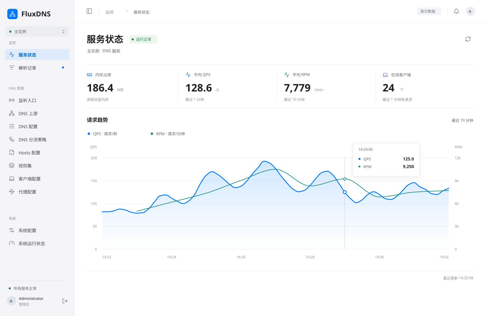
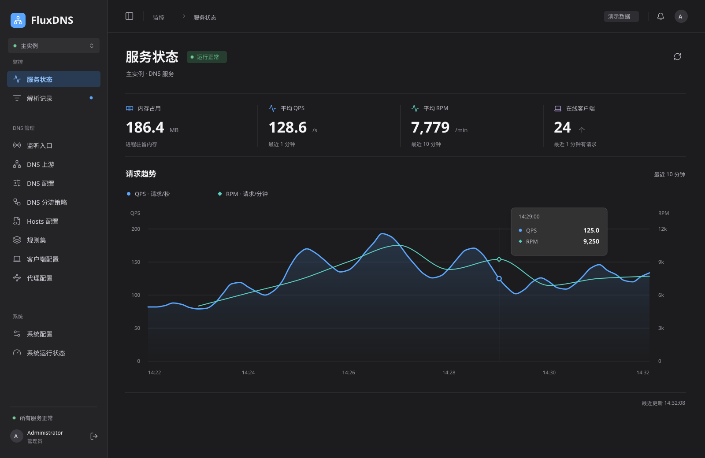
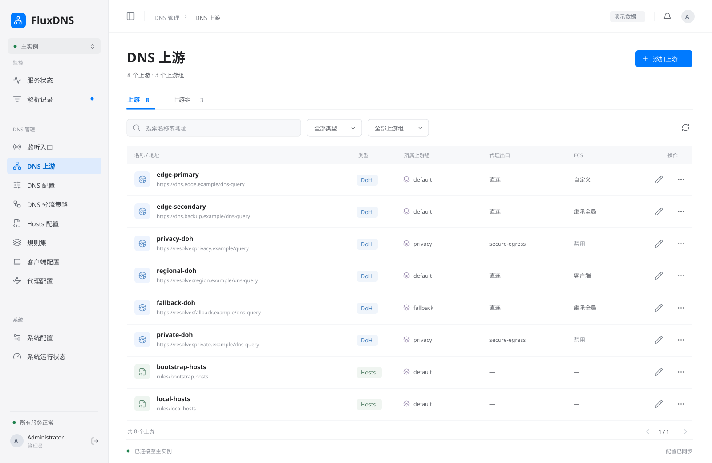
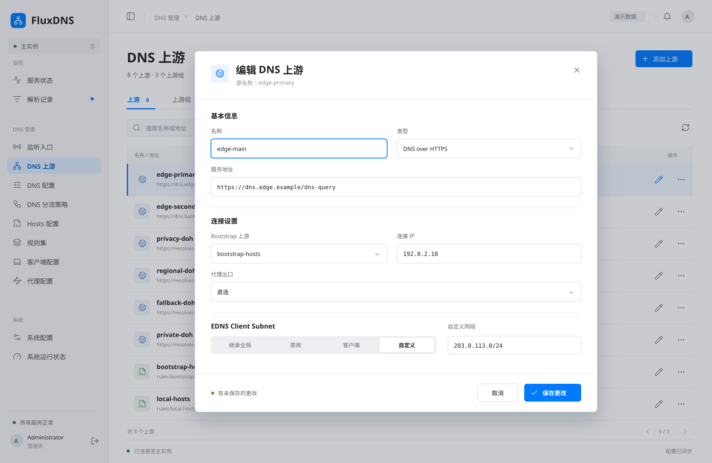
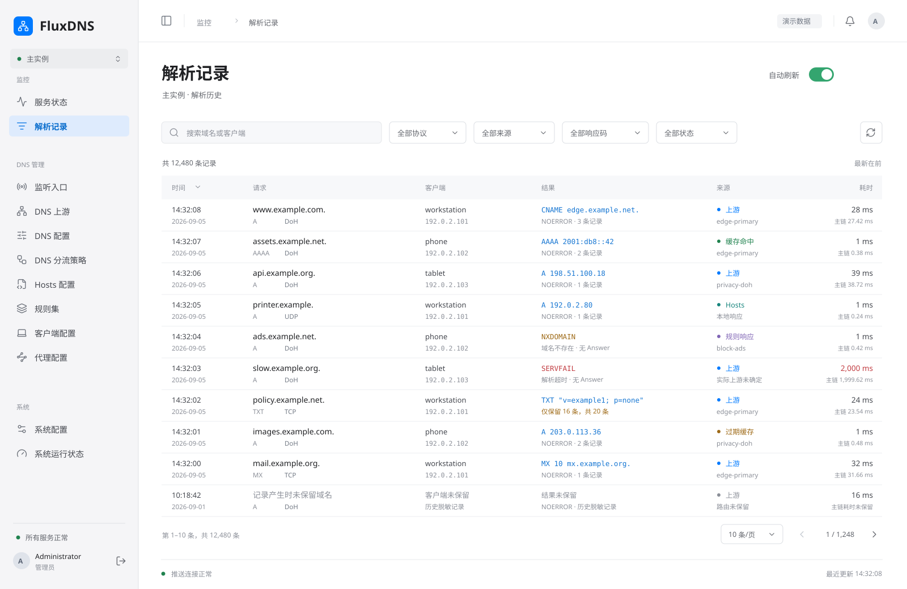
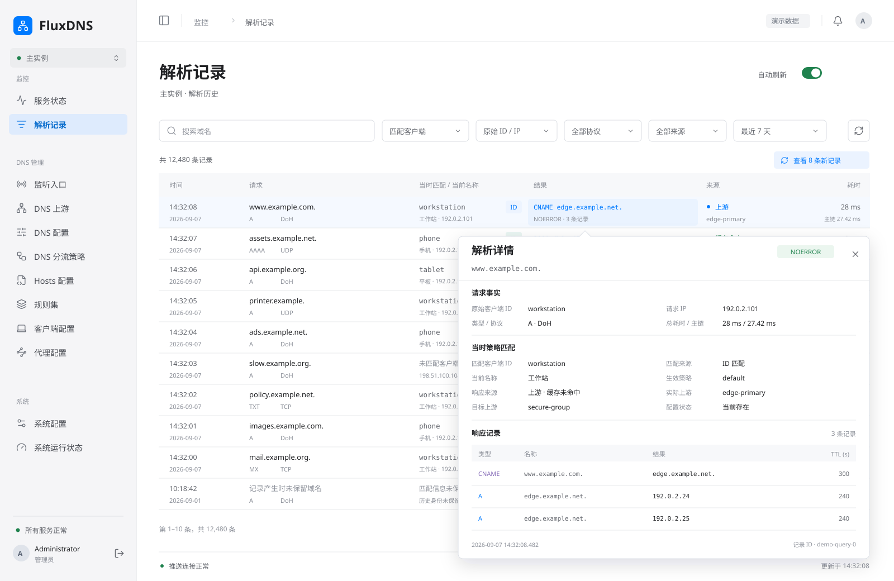

# WebUI 管理后台重构需求

> 文档状态：草案
>
> 适用范围：WebUI 管理后台的功能范围、页面组织、交互风格及后端配套需求
>
> 计划状态：待评审
>
> 代码基线：`56874aab35ff4bc94b3ad84e8f9fc012bb682cb8`（仅静态核对现有页面入口与管理 API 的只读边界）

## 1. 背景与目标

当前 WebUI 是临时性的只读浏览界面，需要升级为能够查看运行状态、浏览解析记录并按模块管理配置的后台。现有页面与接口入口见 [App](../../frontend/src/app/App.tsx)、[Management 查询路由](../../backend/src/management/query.rs) 和 [OpenAPI](../../frontend/openapi/management-api-v1.yaml)；首次初始化、登录和登出不属于这里所说的只读查询。

本阶段整理需求并提供视觉草案，为后续页面设计提供输入，不制定详细设计方案，不设计或实现前端代码，也不修改后端代码与接口契约。

## 2. 总体要求

- 配置按业务模块查看和编辑，使用面向具体配置项的表单，不提供直接编辑整个配置文件的页面。
- 配置类模块原则上具备配置能力；状态和记录类模块用于观测，系统配置模块的可写范围单独限制。
- 本次重构属于破坏性更新，不兼容旧 WebUI 的数据逻辑；允许在后续实施中推翻原有设计并删除被替代的代码。本轮不执行这些修改。
- 前后端共同满足管理后台需求，缺少的数据查询、配置编辑和实时推送能力由后端同步补充。

## 3. 一级模块

各模块作为一级菜单入口，列表、配置概览或运行状态在对应一级页面展示。

| 模块 | 需求范围 |
| --- | --- |
| 服务状态 | 首期仅展示当前内存占用、最近 1 分钟的平均 QPS、最近 10 分钟的平均 RPM、在线客户端数，以及合并的 QPS/RPM 趋势图；在线客户端指最近 1 分钟内有请求的客户端。使用 WebSocket 接收后端实时推送，不展示 WebSocket 连接、通道或推送状态，也不展示监听入口等其他模块的摘要。保留简洁布局，后续按实际需要增加信息。 |
| 解析记录 | 查看解析记录列表，默认按时间倒序；结果列显示响应摘要，鼠标悬浮可查看该条记录的解析详情。支持开启自动刷新，开启后建立 WebSocket 连接，由后端定时推送新增解析请求记录；关闭后停止该页面的自动更新。 |
| 监听入口 | 查看已配置的监听入口，包括 DoH 等入口、启用状态、策略和 ECS 等配置；支持按入口查看和编辑配置。 |
| DNS 上游 | 查看上游及上游组（upstream group）列表；支持编辑各个上游的配置，包括类型和名称，并提供上游组的配置管理入口。名称为唯一标识，修改名称时必须同时向后端发送旧名称以定位原上游。 |
| DNS 配置 | 查看和编辑全局 DNS 配置，包括缓存、ECS 等。 |
| DNS 分流策略 | 查看策略列表，并提供对应策略的配置编辑入口。 |
| Hosts 配置 | 查看和编辑配置中的 hosts 列表。 |
| 规则集 | 查看和编辑规则集列表及其配置。 |
| 客户端配置 | 查看和编辑客户端列表及其配置。 |
| 代理配置 | 查看和编辑代理出口列表及其配置。 |
| 系统配置 | 查看 `logs`、`database`、`webui`、`work` 等系统配置；目前仅允许修改 `logs`，其余系统配置只读。 |
| 系统运行状态 | 展示进程运行时长、内存占用、当前线程数等进程信息。 |

服务状态侧重 DNS 服务的近期业务指标和实时变化；系统运行状态侧重进程自身信息。两处内存信息应保持口径一致。

## 4. 页面与交互要求

- 一级页面负责列表浏览和概览展示，对应配置编辑采用二级弹窗，不进入整份配置文件编辑器。
- 不同配置类型使用定制化弹窗，字段、控件和组织方式应适配该类型，不以一个通用配置文本弹窗替代。
- 整体视觉与交互效果参考苹果生产级界面，强调清晰层级、克制呈现和操作一致性；各模块统一导航、列表、表单、弹窗及状态反馈风格。
- 区分可编辑与只读内容；保存成功、校验失败及连接异常等状态应有明确反馈。
- 服务状态的 QPS 和 RPM 在同一张图中使用折线展示，共用时间轴，以不同颜色、线宽、面积底色、图例标记及明确单位区分两个指标；不得把不同统计窗口或单位当作同一组数值。正常态不展示 WebSocket 状态，数据过期或获取失败时仅给出面向业务的数据异常反馈，避免将旧数据误认为当前状态。
- DNS 上游编辑弹窗的名称使用可编辑输入框，类型使用可切换的选择控件；切换类型后展示对应类型的配置表单。旧名称由编辑会话保留，不要求用户重复填写，也不得被名称输入框的新值覆盖。
- 解析记录的自动刷新开关、WebSocket 连接状态和推送异常应可辨识，避免把连接中断误认为没有新记录。
- 解析详情采用锚定结果单元格的非模态浮层，不跳转页面、不压暗背景；鼠标从触发项移入浮层后保持显示，允许选择并复制文本，移出二者后再关闭。结果项同时支持键盘聚焦打开、`Esc` 关闭及点击/触屏查看，不能把悬浮设为唯一入口。浮层在视口边缘自动避让，内容过长时限制高度并在内部滚动，关闭后保留当前列表位置。
- 查看解析详情期间，自动刷新继续接收记录，但暂缓插入或重排当前列表，以记录 ID 固定详情对象，并显示待更新数量；不得因新增记录而替换鼠标下的内容。详情关闭后再恢复列表更新，点击“查看新记录”时先收起浮层再更新；具体缓冲上限、分页和断线后的补齐方式留待详细设计。

## 5. 后端配套与边界

- 提供各模块所需的配置查询和受限编辑能力，以及服务指标、解析记录、进程信息的数据查询能力。
- 提供服务状态实时推送与解析记录定时增量推送所需的 WebSocket 能力。
- 配置编辑需有后端校验、保存结果和失败反馈；系统配置仅 `logs` 可写的限制必须由后端落实，不能只隐藏前端编辑入口。
- 上游改名保存需同时携带旧名称与编辑后的配置；后端按旧名称定位原上游，并校验新名称的唯一性，不能按新名称误建一条上游。具体请求字段与改名涉及的引用处理在后续详细设计中确定，本轮不修改现有 API。
- “不兼容旧数据逻辑”不等于授权清空用户配置、数据库或运行数据；是否涉及这些内容，需在后续设计中单独明确。
- 本文不规定 API 路径、请求字段、WebSocket 消息格式、前端技术选型、组件结构或配置写入实现。

## 6. 后续设计与验收方向

需求确认后，先制定页面设计方案，再展开前后端详细设计与实施。后续需明确 QPS/RPM 的计算、采样和聚合口径、在线客户端识别方式、推送周期与断线行为、上游改名的引用处理和类型切换的字段校验，以及配置保存后的生效方式；这些尚未确定，不作为已有实现描述。

后续交付按以下要点验收：

1. 12 个一级模块齐全，模块职责与可写范围符合本文。
2. 配置通过模块化表单和定制化二级弹窗编辑，不直接编辑整个配置文件。
3. 服务状态支持实时推送，但不展示 WebSocket 状态或监听入口摘要；QPS/RPM 使用同一张折线图。解析记录保持默认时间倒序，并能开启、关闭基于 WebSocket 的自动刷新。
4. 系统配置仅 `logs` 可修改，其余系统配置在前后端均保持只读。
5. 各模块风格统一，后端提供真实数据与配置能力，不以静态展示代替管理功能。
6. DNS 上游的类型和名称均可修改；改名保存时携带旧名称与新配置，后端定位原上游并校验名称唯一性，保存失败时不丢失原名称。
7. 解析记录结果列可悬浮查看详情，支持键盘与触屏替代入口；浮层不遮挡触发项，自动刷新期间详情对象保持稳定。答案截断、空 Answer、超时和历史未保留等情况必须明确区分，不能以空白或零值掩盖信息缺失。

本文及附图不代表上述功能已完成详细设计、实现或运行验收。未来实施完成后，按[文档维护规则](../rules/documentation-maintenance.md)更新设计和实现文档，并移除本活动文档、附图及索引项；仍有设计价值的附图随已接受设计一并维护。

## 7. 视觉草案

以下六张 SVG 沿用同一套界面风格：浅色图使用浅灰侧栏、白色工作区、蓝色主操作和克制的状态色；服务状态另提供布局与演示数据完全一致的深色图，以中性炭灰底色、分层灰度及适配深色背景的蓝色和青绿色评审深色风格。当前用于评审视觉方向，不是最终页面设计；源文件统一存放在[视觉草案目录](webui-management-designs/README.md)。

图中指标、地址、分组和配置均为演示数据；按钮、筛选和表单为静态示意，不代表交互或接口已实现。

### 7.1 服务状态

仅展示一级导航、四项关键指标和一张 QPS/RPM 双折线趋势图，不再展示 WebSocket 状态或监听入口摘要；下方保持留白，不预填其他模块信息。图中顶部摘要分别使用最近 1 分钟平均 QPS 和最近 10 分钟平均 RPM；趋势图暂以最近 10 分钟为共同时间范围，QPS 示意秒级变化，RPM 示意逐分钟变化，左右轴分别标明请求/秒和请求/分钟。此展示草案仍需后续核定采样和聚合细节，不代表已有指标接口。

图表细节参考 [Apple Human Interface Guidelines：Charts](https://developer.apple.com/design/human-interface-guidelines/charts) 关于数据优先、克制网格、坐标范围和按需查看读数的指导。本图采用蓝色连续主曲线与低透明度面积填充、青绿色细辅助曲线、低对比实线网格，去掉逐点圆圈和交错虚线；仅在选中时刻显示圆形/菱形标记、垂直指示线及集中读数浮层。两条线保持共用时间轴和从零开始的双单位刻度，色彩不是唯一辨识方式；浮层为静态交互示意，不代表已经实现悬停或拖动。

本轮更换了演示序列以评审曲线层次，浅深模式的数据与几何完全一致。曲线连接不应越出相邻样本范围；后续真实指标的采样或降采样必须单独确定，并保留峰值和数据缺口，不能为了平滑外观抹掉异常、跨缺失区间补线，或将插值当成真实采样值。

### 7.2 服务状态 · 深色模式

与浅色图使用相同布局、数据和信息范围，单独用于评审背景层次、文字对比度、导航选中态和曲线辨识度。

### 7.3 DNS 上游

展示上游与上游组的浏览入口、搜索筛选、配置列表和行内编辑入口。

### 7.4 DNS 上游编辑

展示列表之上的定制化二级弹窗，当前类型为 DoH，包括可编辑名称、可切换类型、连接参数、代理出口和 ECS 配置。演示将 `edge-primary` 改为 `edge-main`；标题区保留原名称作为当前编辑对象，保存时需向后端同时发送旧名称 `edge-primary` 与新名称 `edge-main` 所属的新配置。该传参要求不是额外的用户输入项，具体请求字段留待详细设计。

### 7.5 解析记录列表

沿用浅色导航与无卡片包裹的列表布局，按时间倒序展示时间、请求、客户端、结果、来源和耗时。结果列以首条 Answer 的类型及数据作为摘要，下方显示响应码、记录总数或失败/缺失状态；请求列收纳域名、类型和协议，耗时列区分服务端总耗时与 DNS 主链耗时。工具栏展示搜索、协议/来源/响应码/状态筛选和自动刷新；底部提供分页、推送连接状态和最近更新时间，不添加配置写入或删除记录操作。

上游及缓存记录在来源列保持两行结构：第一行标明“上游”“缓存命中”或“过期缓存”；第二行显示实际产生该答案的上游名称。命中缓存时使用 `upstream_used_id` 所记录的缓存生产上游，与普通上游响应保持相同排版，不以“缓存响应”替代名称，也不将上游组目标当作实际上游。该名称表示写入缓存时的来源，不代表本次请求再次访问该上游；记录缺失时明确显示“上游未保留”，不猜测或补造名称。Hosts、规则等本地响应的展示不受此要求影响。

图中同时包含正常答案、缓存命中、Hosts、规则负响应、超时、答案截断、过期缓存与历史脱敏记录，状态文字不只依赖颜色。用于对照的现有字段见 [QueryRecord / QueryAnswer](../../frontend/openapi/management-api-v1.yaml) 与 [QueriesPage](../../frontend/src/modules/queries/QueriesPage.tsx)；现有页面采用行展开，尚非图中的结果列悬浮交互。域名/客户端搜索与 WebSocket 自动刷新属于目标能力，现有 `/queries` 查询参数未包含该搜索条件，本轮不新增参数或实现这些能力。

### 7.6 解析记录悬浮详情

展示同一列表第一条记录的结果悬浮态：触发单元格高亮，浮层在其下方展开并用小箭头连接，列表其他区域不变暗。详情包含完整域名、客户端及有效 IP、请求类型/协议、响应状态、来源/缓存结果、匹配策略、目标/实际上游、两种耗时，以及响应记录的类型、名称、数据和 TTL。示例中一个 CNAME 与两个 A 记录共三条，浮层底部保留发生时间和记录 ID；右上角提供关闭入口。查看期间工具栏显示待更新记录数，当前行不移动。

详情只展示后端实际保留的字段；现有响应是有界 Answer 摘要，不代表完整 DNS wire。`answers_truncated` 为真时明确展示已保留数与总数；`legacy_redacted`、空 Answer 和缺失耗时分别显示原因或未保留状态，不构造缺失内容。缓存命中/过期缓存的上游信息必须标为缓存生产来源，不能暗示本次请求调用了该上游。本图展示可用详情正常态，加载、获取失败、超长内容和触屏交互仍需后续详细设计与验证。

